# Wicked Engine 编辑器文档

## 目录

- [基础](#基础)
- [显示缩放](#显示缩放)
- [HDR 显示输出](#hdr-显示输出)
- [编辑](#编辑)
  - [设置材质颜色](#设置材质颜色)
  - [重命名](#重命名)
  - [添加光照](#添加光照)
  - [导入模型](#导入模型)
- [内容浏览器](#内容浏览器)
- [Backlog](#backlog)
- [地形](#地形)
- [图层](#图层)
- [反射探针](#反射探针)
- [导航/寻路](#导航寻路)
- [物理](#物理)
- [毛发粒子系统/草地](#毛发粒子系统草地)
- [发射器](#发射器)
- [弹簧/摇晃骨骼](#弹簧摇晃骨骼)
- [反向运动学](#反向运动学)
- [表情、变形目标](#表情变形目标)
- [动画重定向](#动画重定向)
- [元数据](#元数据)
- [高斯泼溅](#高斯泼溅)
- [结语](#结语)

## 基础

Wicked Engine 附带一个简单轻量的编辑器应用程序 [下载]，你可以用它打开和编辑 3D 模型，并将其保存为引擎优化的文件格式。你还可以测试和设置各种引擎功能，如图形、物理、音频。你可以直接从编辑器运行脚本，让你快速测试功能，甚至完全在编辑器内部玩用 Lua 编写的完整游戏。编辑器在空闲状态下看起来像这样：

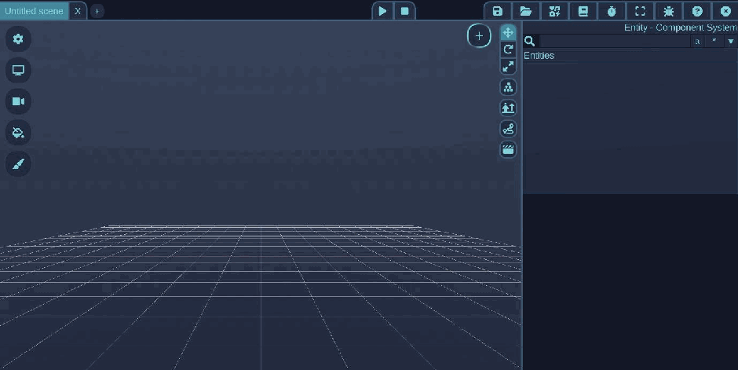

编辑器布局的主要关注区域在下方标出：

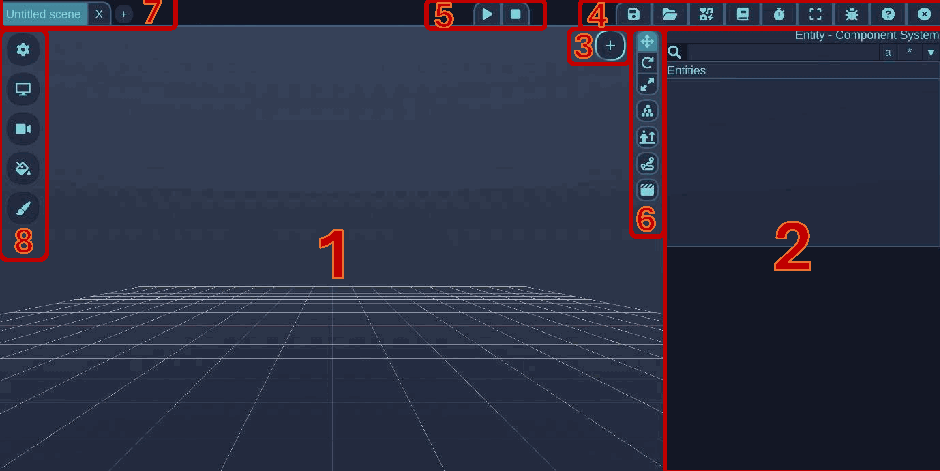

1. **主 3D 工作区**。如果你放置新实体，它们将在此处可视化。默认情况下你可以用 WASD 键移动相机，或者如果控制器连接到第一玩家槽位，可以用控制器的模拟摇杆或方向键。默认情况下，你可以按住鼠标右键用鼠标以第一人称控制方式环顾四周，或用控制器的右模拟摇杆。左鼠标按钮将用于选择鼠标指向的 3D 对象。

2. **实体-组件系统面板**（右侧）将在"Entities"面板中显示当前场景中实体的层次列表。如果选中一个实体，"Entities"面板下方将出现更多控件（稍后展示）。

3. **"+"按钮**（3D 工作区右上角）是主按钮，可用于向场景添加新实体，如对象、材质、光源、声音、地形等。点击按钮将显示一个长下拉列表，你可以在其中选择要添加的内容。你可以用鼠标滚轮滚动此列表，或使用左侧的滚动条，因为并非所有项目都能同时显示。

4. **顶部菜单**有许多按钮，每个都可以执行编辑器的主要操作。如果你将鼠标悬停在每个图标上，将显示有关每个操作的附加信息。首先，只需将鼠标悬停在上面就会展开操作的基本文本，如果继续悬停，还会显示工具提示。这些操作包括：
   - a. 保存当前场景
   - b. 打开模型、场景、脚本或其他资源
   - c. 打开内容浏览器
   - d. 打开 backlog
   - e. 打开性能分析器
   - f. 在窗口模式和全屏模式之间切换
   - g. 前往错误报告网站
   - h. 显示帮助
   - i. 关闭编辑器

5. **脚本控制按钮**，你可以在此快速运行之前使用的脚本，或停止所有作为 Lua 进程在后台运行的脚本。如果你之前没有使用任何脚本，"播放"按钮将打开一个文件浏览器窗口，你可以用它打开 Lua 脚本文件。

6. **3D 工作区右侧**有几个小按钮，映射到常用操作：
   - a. 在平移/旋转/缩放模式之间切换，这适用于选中具有 Transform 组件的对象时的变换工具控件。
   - b. 开启/关闭物理模拟，用此可以关闭物理模拟，使动态对象不会掉落。在编辑具有物理对象的场景时关闭物理模拟很有用。
   - c. 开启/关闭参考虚拟可视化器。这可以显示一个幽灵角色，你可以按住鼠标中键并指向表面将其放置在场景中。用于在不向场景添加额外对象的情况下测量对象相对于一般人体比例的缩放。要查看精确控件的更多信息，将鼠标悬停在按钮上短时间即可查看工具提示。
   - d. 开启/关闭导航测试模式。这可用于测试在场景中放置两个路径点并显示它们之间的寻路结果。这要求场景中有体素网格。要查看精确控件的更多信息，将鼠标悬停在按钮上短时间即可查看工具提示。
   - e. 进入电影模式，整个界面将被禁用，整个窗口将显示 3D 渲染结果。用于截图。要退出，按 Escape 键。

7. **场景选择器**，你可以创建新场景、在场景之间切换或关闭场景。所有操作仅适用于当前选中的场景。

8. **附加工具**，点击这些按钮中的任何一个将在 3D 工作区左侧打开一个面板，你可以在其中执行附加任务：
   - a. **选项**：所有常规选项将在此显示，如选择语言、主题或选择要显示的附加内容。
   - b. **图形**：所有渲染选项将列出，如阴影、后处理等。
   - c. **相机**：主相机的选项，如移动速度、视距、视场角，以及一些附加辅助功能，如放置和跳转到辅助相机。
   - d. **材质列表**：列出当前场景中的所有材质，并显示其第一个纹理（如果有）的预览。在此选择材质也会在"Entities"面板中选中它们。
   - e. **绘制工具**：这可用于在场景中绘制各种参数，如绘制到纹理、顶点颜色、物理、粒子系统等。

现在让我们看看当场景不为空且选中某些内容时我们能做什么。点击"+"按钮并添加一个新立方体：

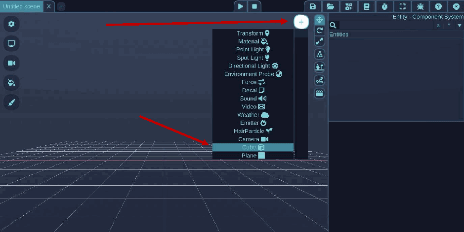

当立方体被添加时，它也会被选中，你可以在实体-组件系统面板中看到所选实体的附加控件：

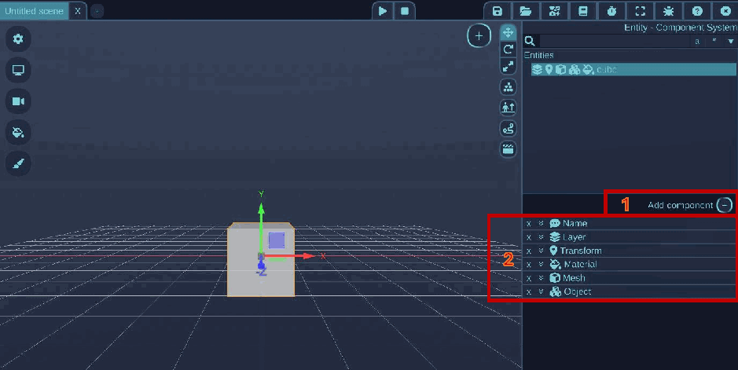

1. **"添加组件"按钮**用于向所选实体添加组件。组件类型为实体添加特定功能，如名称、材质（纹理、颜色、表面...）、网格（几何体）、图层（过滤）等许多不同的组件类型。

2. **附加到所选实体的组件列表**。每种组件类型可以通过按其名称旁边的向下箭头打开。也可以通过按 X 按钮从实体中移除组件。

此外，在 3D 工作区中，所选立方体也以橙色轮廓高亮显示，变换工具可见。变换工具用于在 3D 空间中放置所选对象。

## 显示缩放

编辑器的界面将遵循 Windows 操作系统设置中指定的显示缩放：

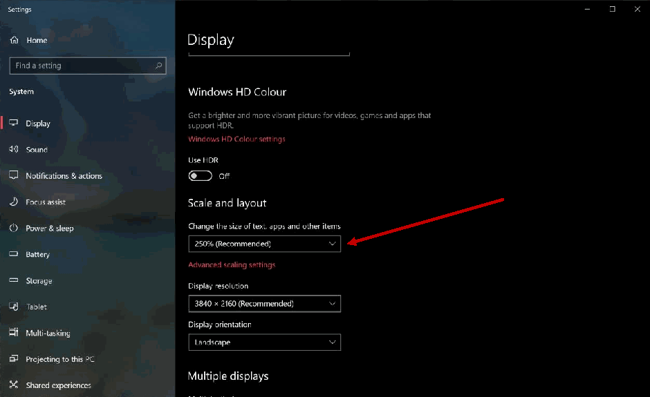

如果你在常规选项中打开信息显示，可以进行验证：

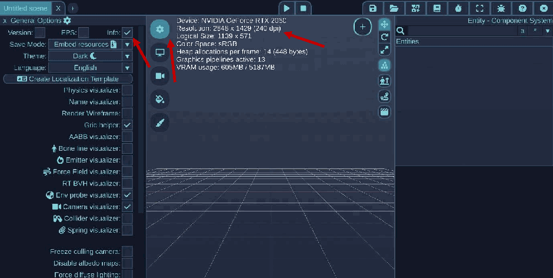

dpi 值对应 Windows 中的缩放设置，96 dpi 是对应 100% 缩放的默认值。在 4K 等高分辨率显示器上，缩放通常会增加，使屏幕元素更大以帮助可读性。

在同一显示器上以较低缩放运行的编辑器可能变得不太可读：

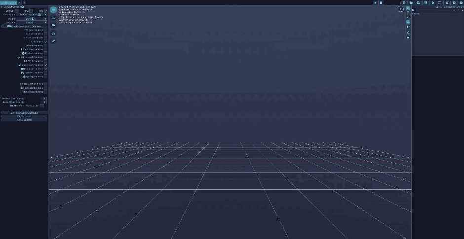

可以通过在 exe 附近的 startup.lua 文件中输入以下行来用特定值覆盖缩放，这会将缩放设置为 1.5 倍（= 150%）：

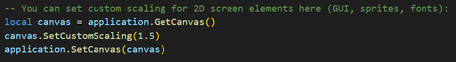

```lua
application.GetCanvas().SetCustomScaling(1.5)
```

除此之外，你还可以在此文件中执行任意 lua 脚本，这些脚本将在启动时执行一次。有关更多 lua 命令，请查看 Content/Documentation 中的 LUA 脚本文档。

## HDR 显示输出

Wicked Engine 支持 HDR 显示输出，默认启用但仅在使用 HDR 显示器时生效。可以在图形选项 -> 显示输出组合框中检查。默认情况下，如果显示器非 HDR 则为 SDR 10bit，如果显示器为 HDR 则为 HDR 10bit。如果需要，你还可以在 HDR 显示器上强制为 SDR。

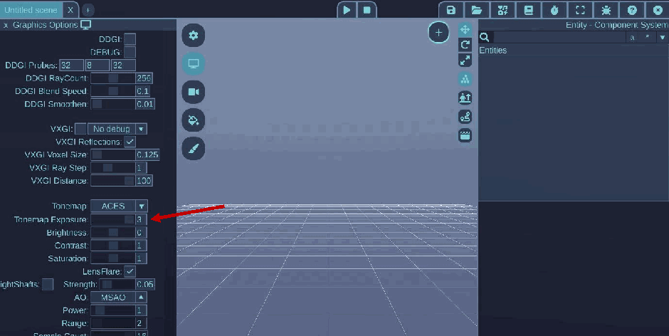

启用 HDR 后，截图可能会产生一些意想不到的结果，或者 3D 渲染区域可能变得过暗。预期的是，使用 HDR 显示时，相机曝光需要一些调整才能获得好的结果。在游戏中，这可以放到 HDR 校准选项屏幕上。在编辑器中，你可以在图形选项中调整曝光，这将影响 3D 渲染结果，但不影响 GUI：

## 编辑

### 设置材质颜色

作为第一个练习，让我们将立方体的颜色设置为红色。点击材质图标旁边的向下箭头打开材质设置。

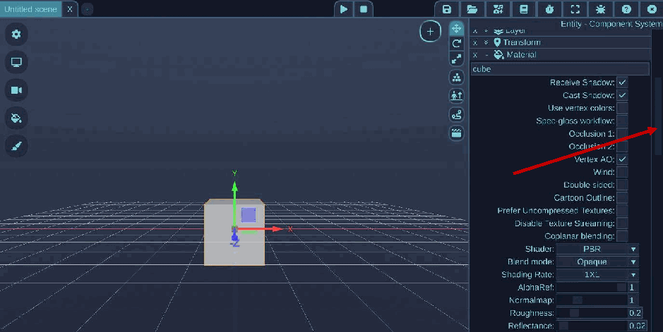

当材质面板打开时，向下滚动直到看到颜色选择器：

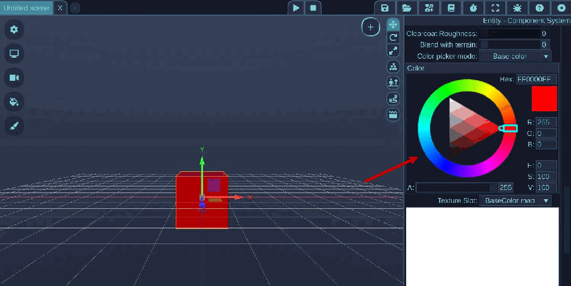

然后可以使用颜色选择器选择所选对象所选材质的颜色：

#### 复制对象

按 Ctrl + D 复制所选对象，然后用变换工具抓住它将其移开一点。你也可以使用 Ctrl + C 和 Ctrl + V 复制和粘贴对象，这与 Ctrl + D 功能相同。

你会注意到两个对象都是红色的，如果你修改材质颜色，它们都会使用相同的颜色。现在让我们用材质设置中的颜色选择器将它们设置回白色：

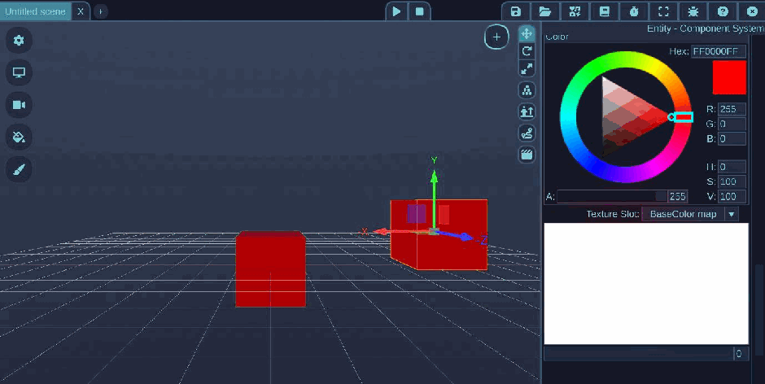

这是因为两个对象使用相同的网格，并通过该网格使用相同的材质，所以它们是实例化的。实例化很有用，因为它帮助渲染器将它们全部批量到一个绘制命令中，这更优化。但是，实例化仅在两者都使用相同网格和相同材质时才有效。你也可以控制对象的一些每实例属性，如颜色，你可以从对象设置中控制。我们可以将其中一个对象设置为红色，同时通过在对象设置而不是材质设置中设置颜色来保持另一个的颜色：

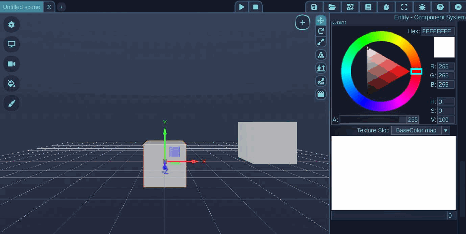

### 重命名

要为立方体设置名称，你可以转到名称组件设置并输入不同的名称：

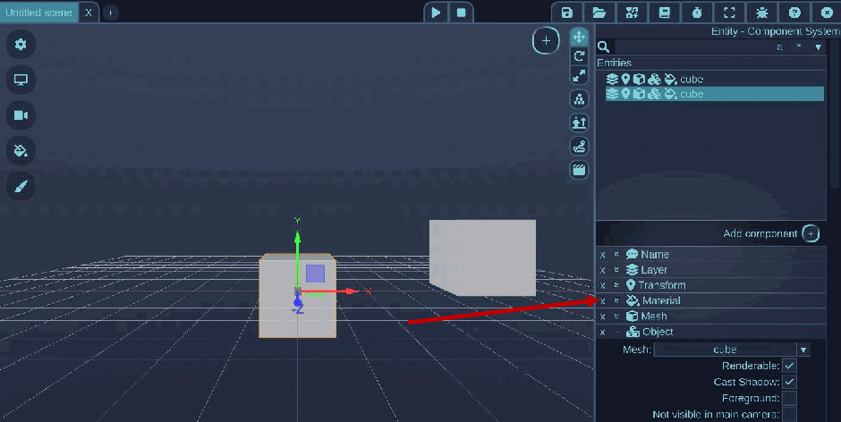

实体上不需要有任何组件，因此删除名称组件也是有效的。在这种情况下，红色立方体将是一个没有名称但有其他组件的实体。编辑器将在"Entities"面板中将其显示为 [no name] 后跟实体 ID：

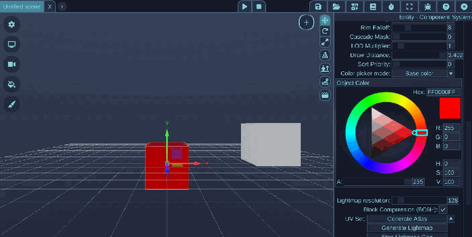

如果你按住"i"键的同时将鼠标悬停在 3D 工作区中的对象上，则会在鼠标位置显示它们的名称和实体 ID。

为对象设置名称在你想通过名称在脚本中查找对象时很有用，否则引擎不在乎。现有实体 ID 保证在应用程序持续时间内保持有效，但不保证在另一次应用程序运行中有效，因此不能在所有情况下依赖它们。

### 添加光照

通过点击"+"按钮添加一个点光源：

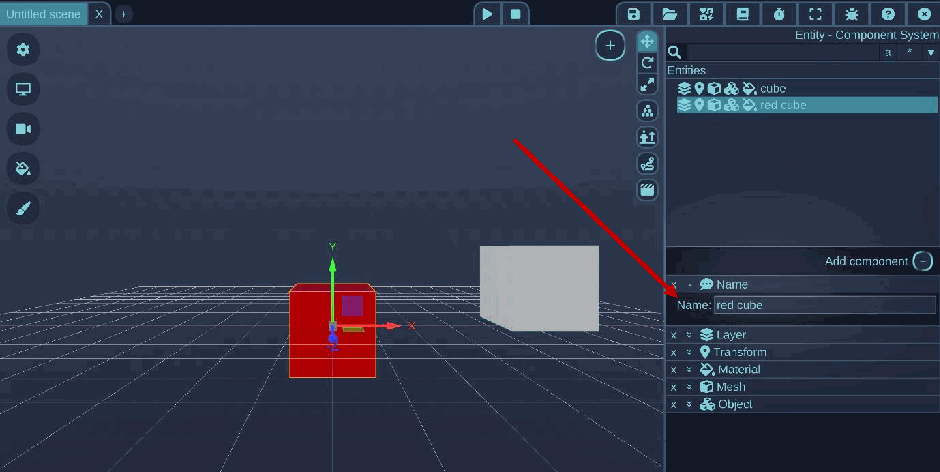

点光源添加在相机前方并被选中，移动相机和光源使其定位在红色立方体上方某处：

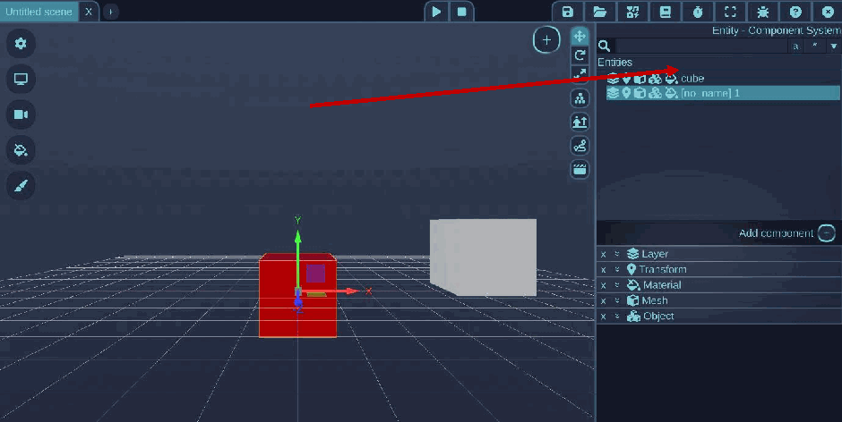

编辑器中的默认光照很亮，所以一开始可能有点难以看到光源的效果，但如果你把它放在对象附近，它会很明显可见。还放一个新平面对象（如果红色立方体仍在原点，它可能会被遮挡，但这不是问题）并将其放大，使其作为场景的地面。要缩放它，你可以通过按缩放图标并使用鼠标与变换工具切换到缩放模式，或打开变换设置并输入值。我决定在所有轴上统一缩放到 100：

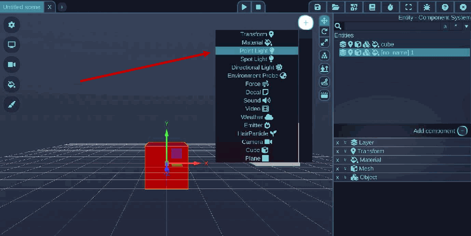

现在尝试调整光源参数，如颜色、强度、范围，并设置投射阴影：

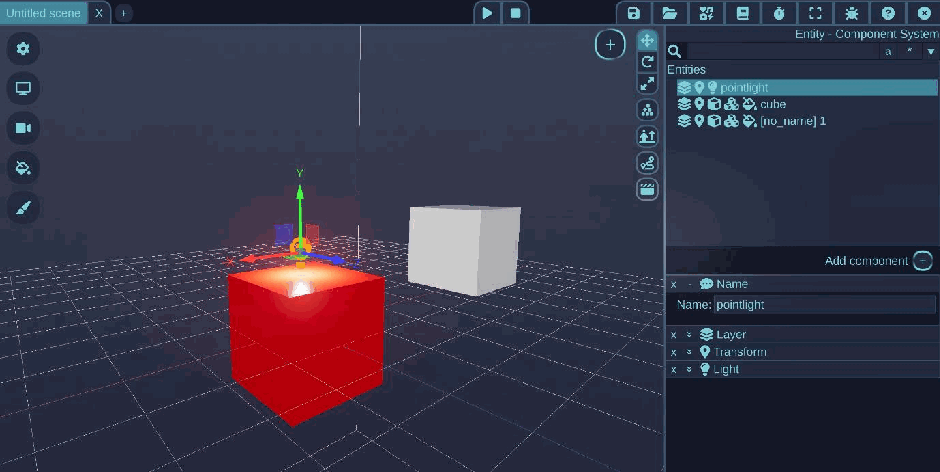

现在你看到它从下方的立方体在地面上投射阴影，虽然看起来有点平淡，阴影区域细节不多。可以在图形选项中轻松启用后处理环境光遮蔽来稍微改善外观。如果选择环境光遮蔽方法，我推荐默认使用"MSAO"选项，因为它有相当好的性能/质量权衡：

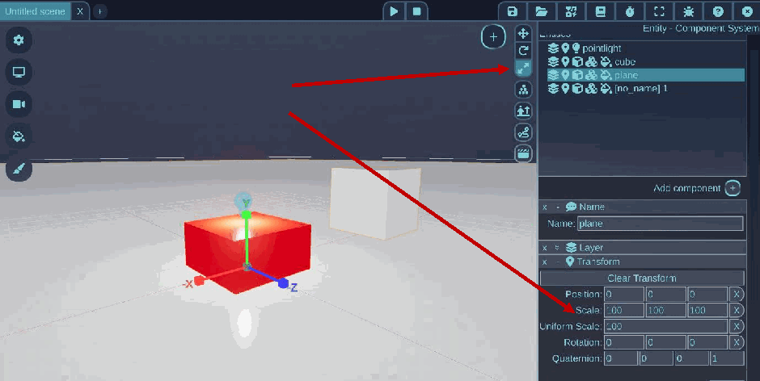

MSAO 效果将作用于整个 3D 场景，在阴影区域内添加接触细节，改善深度感知。你可以在阴影角落或靠近或相交的几何体中看到它。

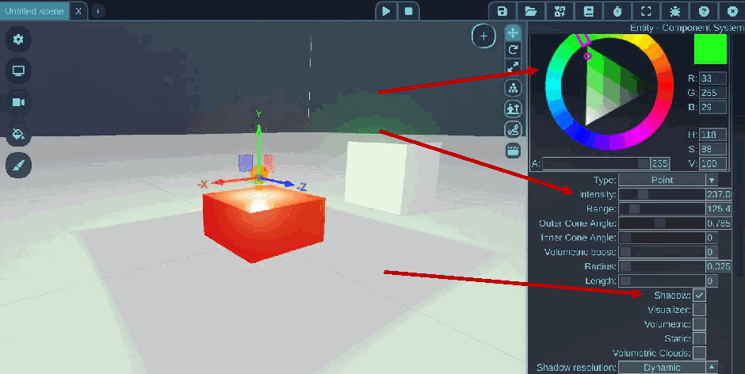

还有其他几种环境光遮蔽和其他图形技术可以改变场景外观。首次使用编辑器时，默认设置已关闭大多数此类附加效果，但修改它们将被记住用于编辑器应用程序的下一次运行。设置保存在可执行文件附近的 config.ini 文件中。

现在你可以按 Ctrl + S 将模型保存为 wiscene。

### 导入模型

你可以将常见模型格式导入编辑器，支持的格式有：
- **GLTF 2.0**：GTLF 或 GLB 扩展名
- **FBX**
- **OBJ**
- **VRM**

要导入模型，最简单的方法是将模型或多个模型拖放到编辑器窗口中（目前仅 Windows 支持）。除此之外，顶部菜单中的"打开"按钮也可以工作，它会让你浏览文件并打开单个模型。你还可以使用顶部工具栏左侧的场景选择器指定将模型打开到哪个场景。你可以从 Mixamo.com 轻松下载带动画的绑定 FBX 模型，在此示例中我将使用该站点的一个模型并将其导入新场景，然后将相机移近它：

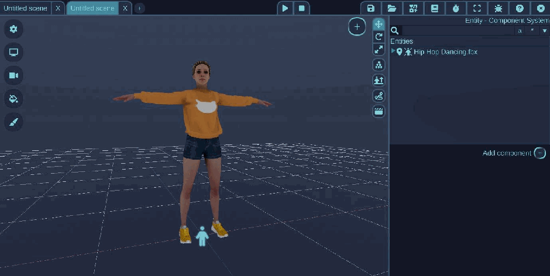

FBX 模型可能有复杂的层次结构，不仅有网格，还有骨架和动画。由于复杂性，某些材质在导入时可能看起来奇怪，因为它们可能遵循其他材质制作规范。通常，导入 GLTF 和 VRM 模型时材质效果最佳。对于此 FBX 模型，我将进行一些快速修复修改。

第一个问题是当我添加光源时可见的，脸部和毛衣的材质显得太亮：

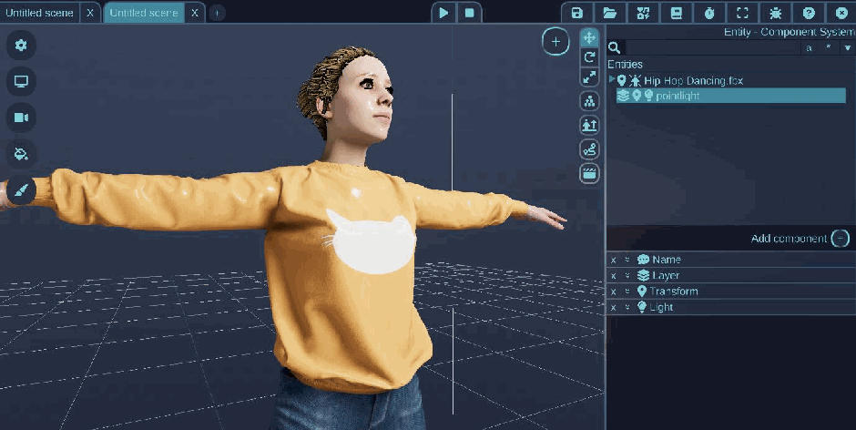

从左侧的材质浏览器窗口中选择材质，或通过点击 3D 对象上的它们，并增加粗糙度参数使光泽更柔和：

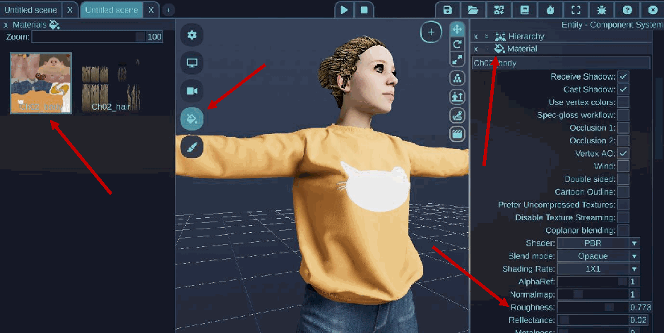

另一个问题是头发卡片在其纹理中有透明度，但 FBX 材质没有提供适当的参数：

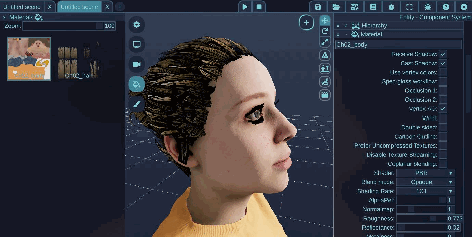

与其在头发材质上使用真正的透明度，不如使用 alpha 测试更高效，以在所有视角保持正确的渲染顺序和更优的渲染。降低头发材质的 alphaRef 值来获得此效果：

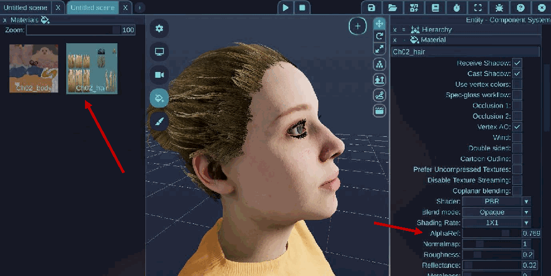

AlphaRef，也称为 alpha 测试，保持材质不透明，因此与其他深度缓冲区效果正常工作，同时简单地丢弃 alpha 低于 alphaRef 值的像素。为了改善 alpha 测试材质的外观，我们可以选择在图形选项中打开时间抗锯齿（"Temporal AA"）。时间抗锯齿可能有一些缺点，但除了抗锯齿外，它还可以大大柔化 alpha 测试纹理：

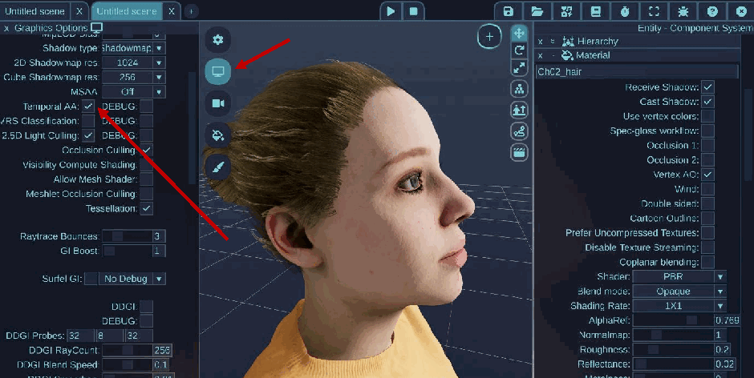

我喜欢为皮肤材质设置的另一件事是次表面散射，使其在各种光照条件下更柔和。即使整个角色使用与皮肤相同的材质（除头发外），你也可以尝试这个来查看效果。增加次表面散射材质值，并通过将颜色选择器模式更改为"Subsurface Scattering"来设置微红的次表面颜色：

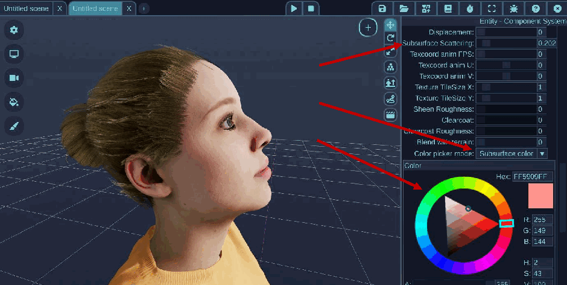

你可以看到皮肤上阴影和光线之间的区域被平滑处理并带有微红色调。

使用 Mixamo 和 VRM 模型，你会注意到默认情况下角色总是试图看向你的鼠标，这是因为它们是用人形骨架导入的：

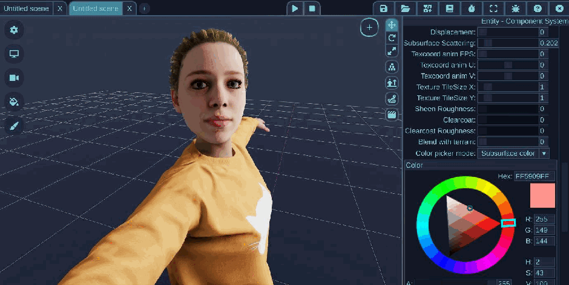

人形骨架有一些有用的属性，但现在只看如何根据需要关闭此行为。打开整个模型实体的人形组件并关闭"LookAt"：

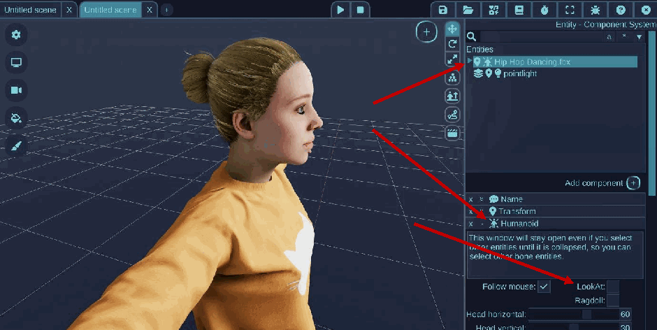

禁用"LookAt"将使角色面向默认方向，而关闭"Follow mouse"将使其保持在当前方向，但不再跟随鼠标移动。

此模型还有一个动画（在 Mixamo.com 上你可以轻松选择下载的模型应该有哪个动画），你可以通过找到具有动画组件的实体并按动画设置中的播放按钮来简单播放。

要找到动画实体，你可以打开模型文件的层次结构并找到带有奔跑小人图标的实体：

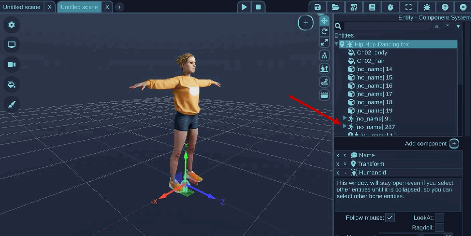

好吧，如果有两个且都未命名，但我碰巧知道第二个是我在 Mixamo.com 上应用的动画，所以我选择那个，并打开动画组件设置，然后按那里的前进播放按钮。动画立即开始播放：

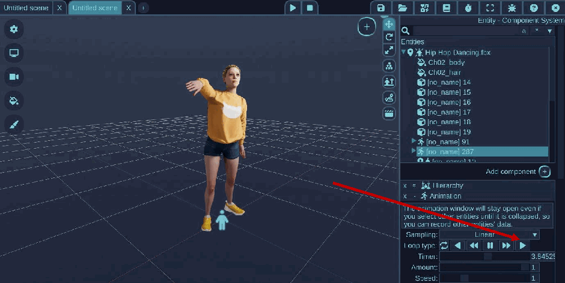

因为这是带有骨架（Armature）的模型，你还可以在 3D 工作区中角色下方看到一个小人图标。如果你点击它，可以看到构成骨架的所有骨骼：

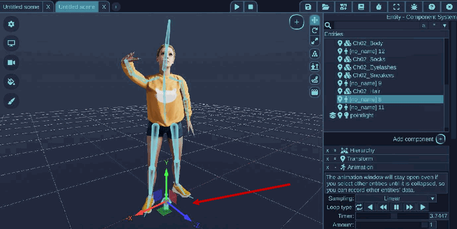

所有骨骼都是实体，当像这样可见时，你可以在编辑器中通过点击选择和修改它们，或者也可以在实体层次结构面板中选择它们。因为必须选择骨架才能使骨骼可见，但当你选择骨骼时，骨架不一定仍然被选中，编辑器将在其任何骨骼也被选中时保持骨架可见。此外，你可以使编辑器始终渲染场景中的所有骨架，无论是否选择了任何内容，在常规选项中：

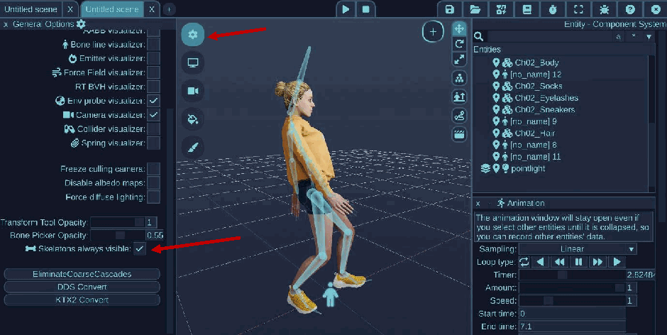

还可以在此处调整骨骼可视化器的不透明度。

现在你可以按 Ctrl + S 将模型保存为 wiscene。

## 内容浏览器

内容浏览器是查看提供的示例内容以及之前在编辑器中使用过的内容的好方法。要打开它，从顶部菜单工具栏中选择其条目。按下它将立即在中间打开一个大窗口：

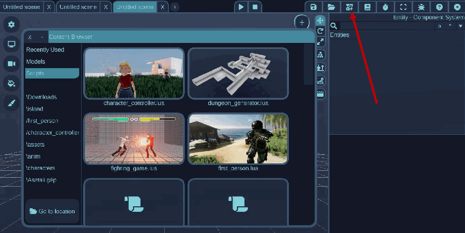

"Models"和"Scripts"文件夹始终从基本 Content 文件夹显示，而"Recently used"文件夹不是真正的文件夹，而是列出你最近使用的模型和脚本。如果有任何最近使用的文件夹，也会在下方左侧显示。wiscene 模型（从编辑器保存的）将显示预览图标，以及一些在其文件夹中有缩略图图像的特定脚本。对于 FBX 和其他模型格式，将没有预览图像。点击其中任何一个一次，它们将被打开。例如，尝试运行 character_controller.lua 脚本以在编辑器中运行角色迷你游戏示例。你可以用 Escape 键退出此脚本返回编辑器。

## Backlog

Backlog 是一个有用的工具，用于查看来自引擎的文本信息，如基本信息或警告、错误。要打开它，按 Home 按钮或从顶部菜单工具栏中选择其图标：

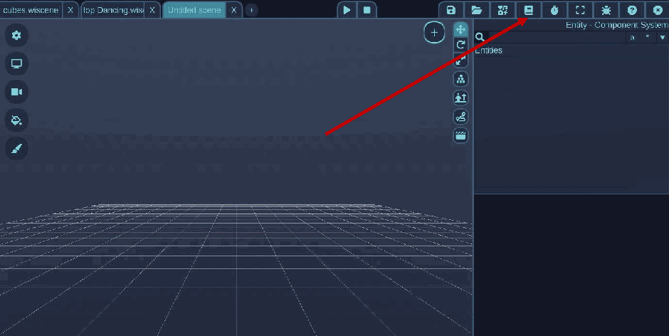

你也可以在此输入 lua 命令。有关更多信息，请查看 Content/Documentation 文件夹中的脚本 API 文档或 Content/scripts 中的示例脚本，了解你可以在 Lua 中做什么。

## 地形

你可以在编辑器中轻松创建新地形，通过从"+"按钮添加新地形：

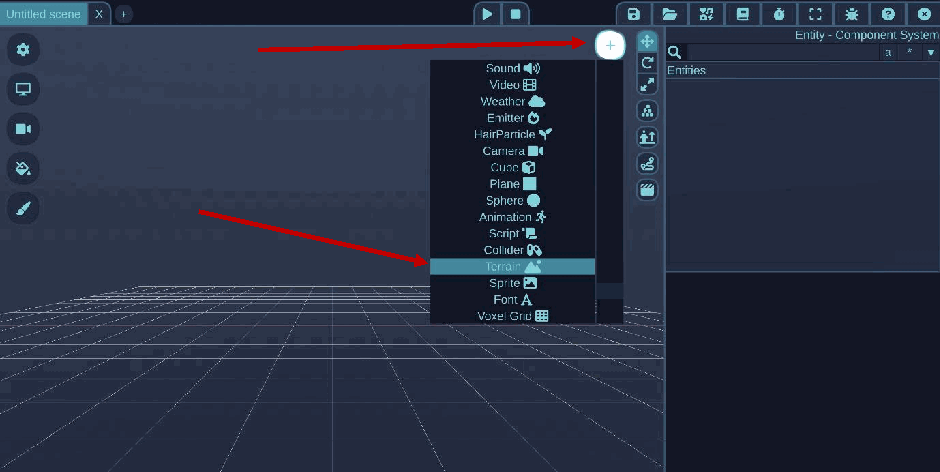

一旦点击它，将生成一个地形：

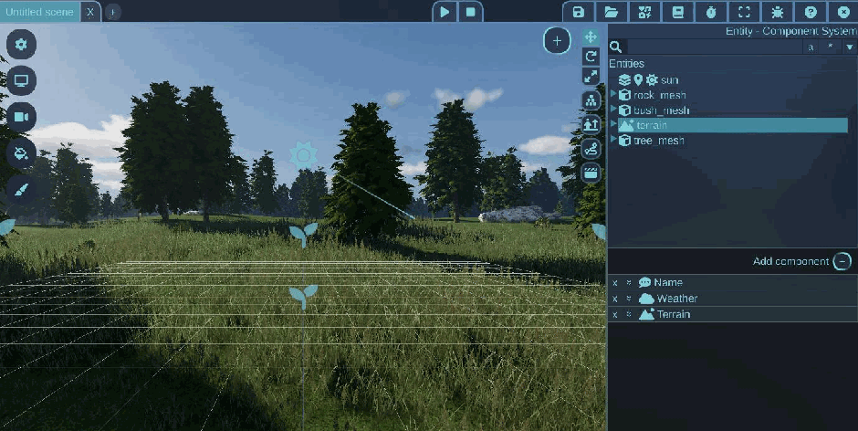

如果你的地形大多是白色的，没有树木、草地和其他模型，这意味着找不到 Content/terrain 文件夹，或者不包含这些资源。这是有效的，但作为便利，编辑器附带了一些简单资源以默认显示相对好看的地形。与其他新创建的实体一样，地形实体默认被选中，你可以从右侧的实体-组件系统面板访问地形组件的设置。你还可以在实体列表中打开地形的层次结构以查看它由什么组成。你可以尝试的一个简单操作是从地形设置中设置新的地形预设，你将获得一种新的外观，例如 Islands 预设：

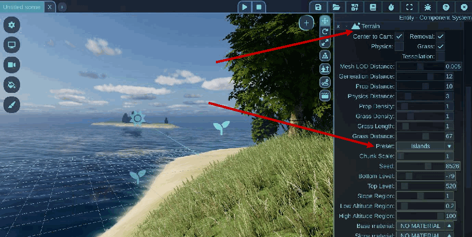

地形创建有很多参数，大多数需要尝试。如果将鼠标悬停在上面短时间，每个设置都可以找到工具提示。要对手动编辑地形，我们还可以使用绘制工具的各种功能。在左侧打开绘制工具并选择"Terrain material"模式：

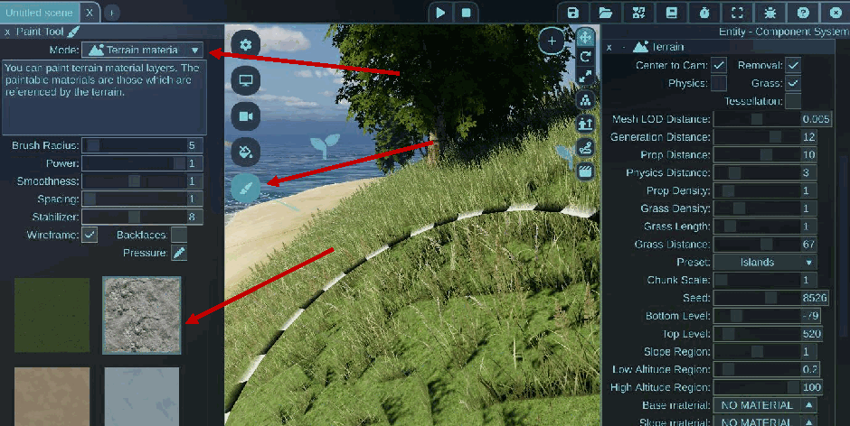

这让你可以从多个预定义材质资源中选择，并使用鼠标在地形表面上绘制：

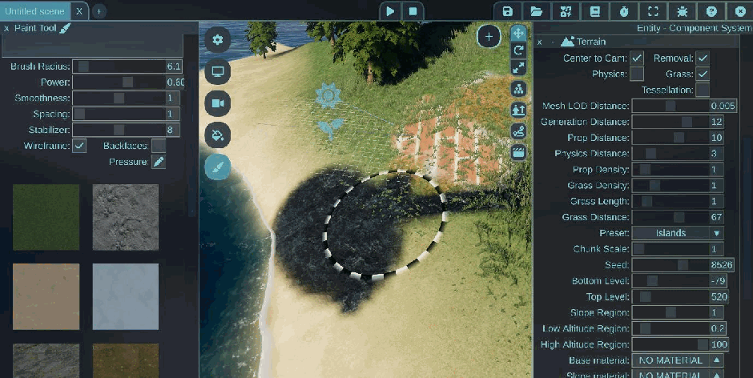

你可以用滑块调整画笔参数，也可以通过滚动鼠标滚轮调整画笔大小。你可以用此在地形上轻松绘制完整材质。但其他内容也可以绘制，例如通过 Sculpt 模式创建山丘：

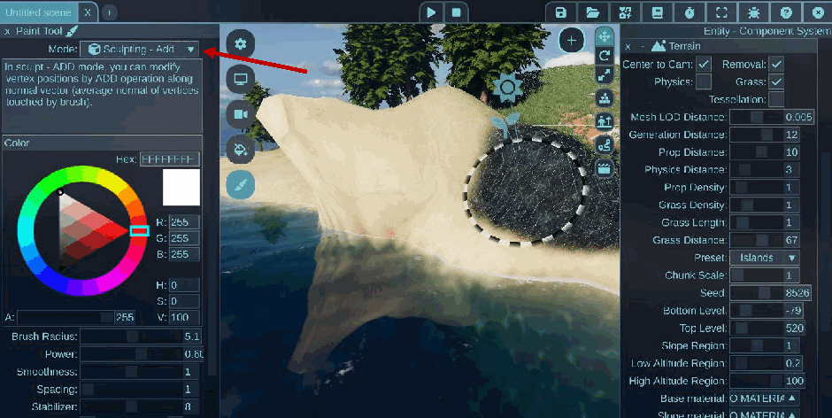

地形作为高度图生成，但通过雕塑你不再局限于高度图，例如也可以创建简单的悬垂。在雕塑模式中，你还可以通过"terrain only"复选框将影响限制为仅地形网格。

你还可以使用 HairParticle 绘制模式在地形上绘制草地覆盖。例如，Hairparticle – Add Triangle 模式将地形三角形添加到草地生成中，意味着这些三角形将长草，所以你可以在以前没有草的地方绘制它：

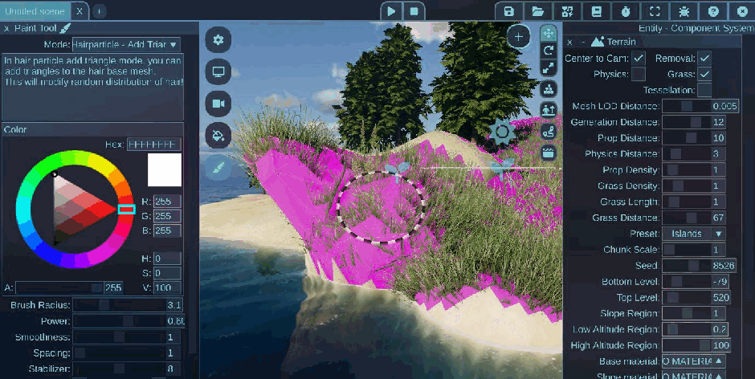

注意：地形与其他对象不同，因为它使用虚拟纹理系统，意味着纹理在运行时生成以获得最佳细节级别。因此，常规纹理绘制模式不适用于它。纹理绘制仅适用于常规对象。还有其他有用的绘制模式，如绘制哪些顶点应接收风效果，哪些顶点应是软体或布料模拟的一部分。

地形的另一个有趣方面是天气系统，默认设置为具有不错的真实外观。不需要有地形来实现这个，但通过生成地形，你可以获得一个可以编辑和尝试的不错默认天气。你可以从地形实体的天气组件设置访问天气参数：

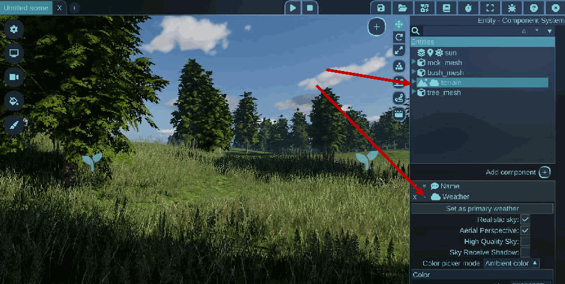

有很多天气设置，但对于最有趣的，尝试修改云参数，即"Coverage amount 1"和"Coverage minimum 1"来创建阴天天气：

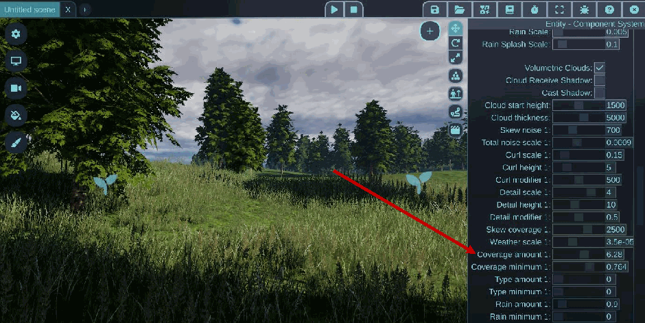

现在天气非常多云，但太阳似乎仍在照耀，你可以为体积云启用"Cast shadow"以阻止阳光，但会有一些额外的性能成本：

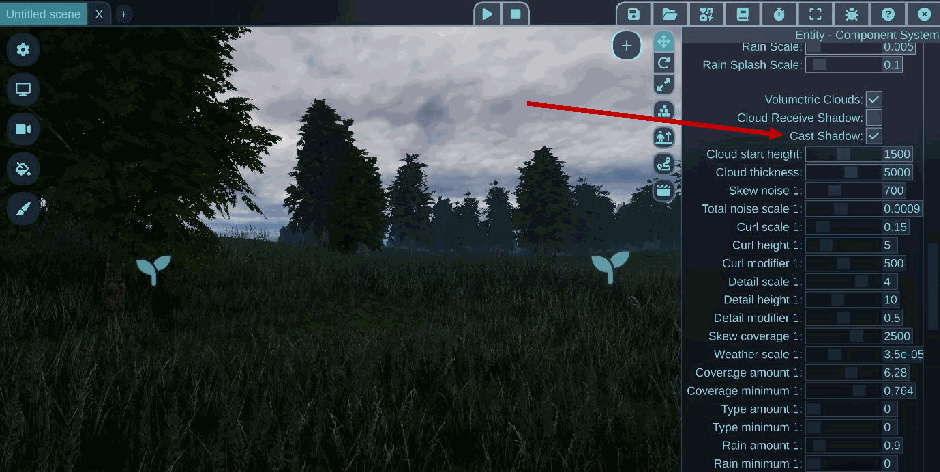

现在用"Rain Amount"滑块添加一些雨：

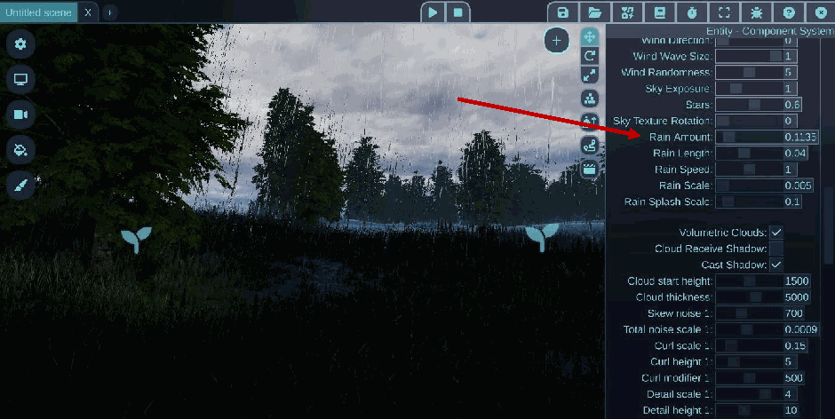

一天中的时间可以由场景中表示太阳的方向光控制。现在，恢复多云和更改以获得更晴朗的天空，找到具有太阳图标的方向光，然后选择它：

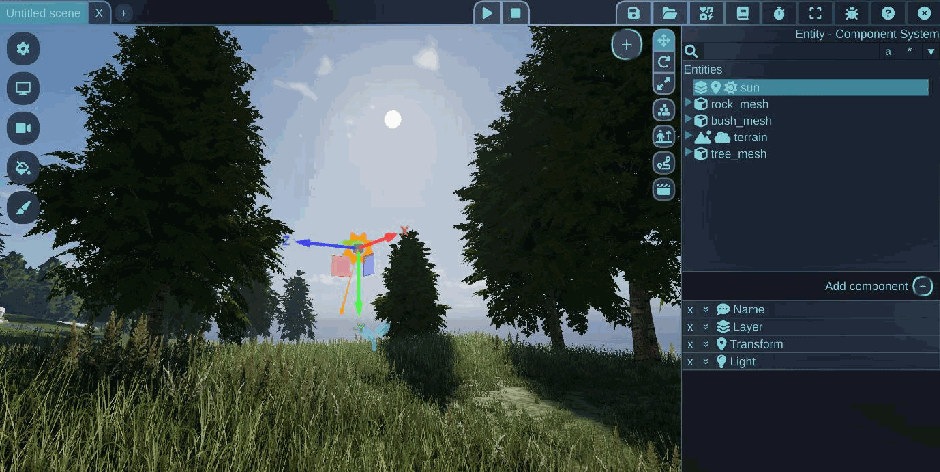

现在按 2 或点击旋转模式按钮切换到旋转模式。旋转太阳直到它降到地平线后面以创建黄昏或夜间场景：

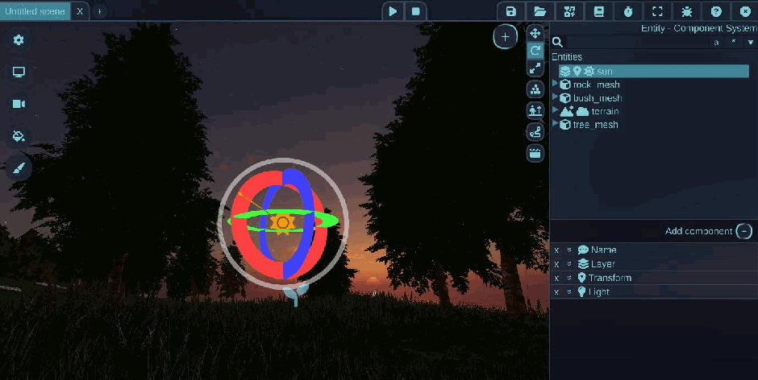

如你所见，天空颜色随太阳方向动态变化，当开始变暗时星星也开始出现。你还可以用简单天空或自定义立方体贴图纹理替换真实天空，这将不受太阳方向影响。在天气系统中，你可以找到"Load sky"按钮，它将让你导入立方体贴图或 2D 球形映射图像并将其设置为天空。你可以找到 Content/models/sky.dds 文件是一个可以尝试的示例立方体贴图：

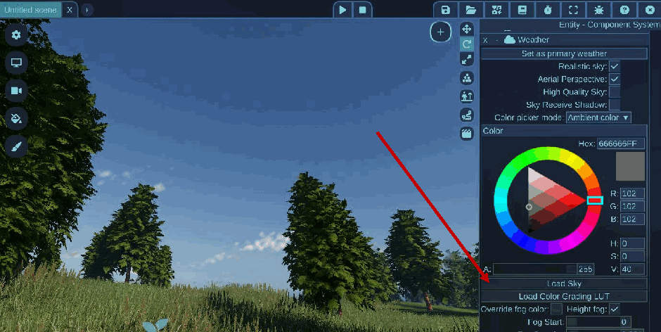

选择 sky.dds 后，你将看到天空将被静态立方体贴图纹理替换。体积云仍将在其上方可见，但你也可以关闭它们：

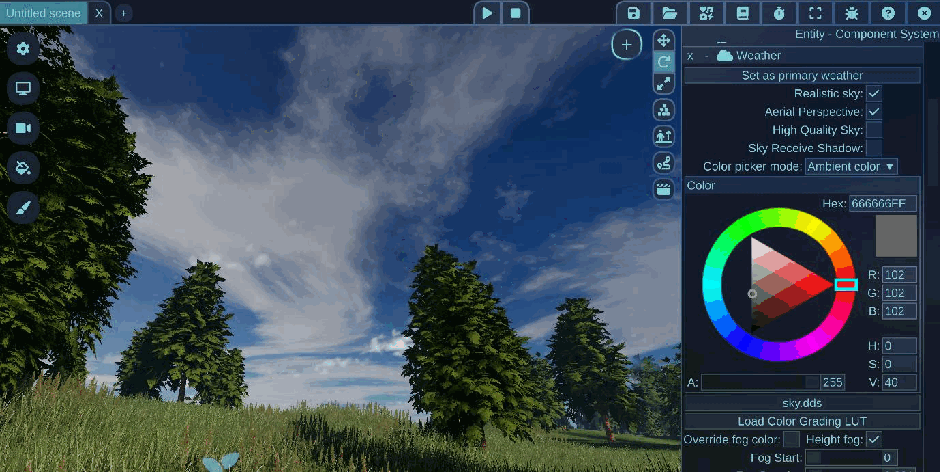

地形系统还有更多功能，但我希望展示这些基础能帮助你开始地形编辑。

## 图层

图层可用于过滤各种内容。例如，告诉材质不应从特定光源接收光，或对象不应在立方体贴图反射之一中可见，或贴花不应影响特定表面，或只是完全停用对象参与主要系统。对于简单测试，添加一个立方体和一个光源：

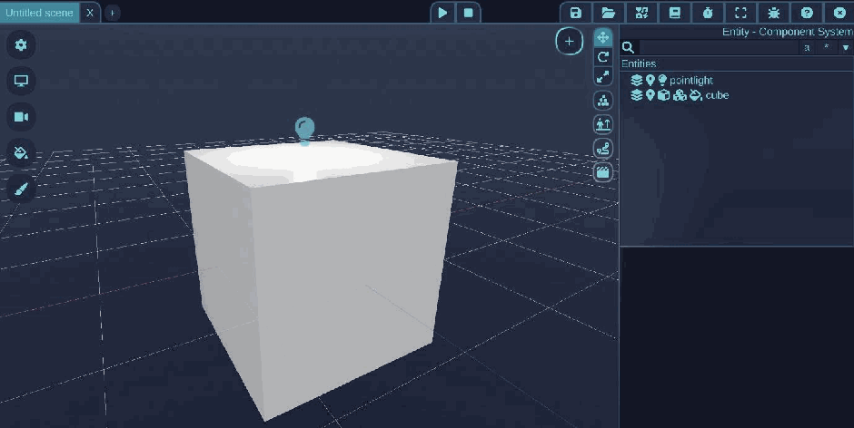

选择立方体，然后从图层设置中禁用所有图层，使立方体消失：

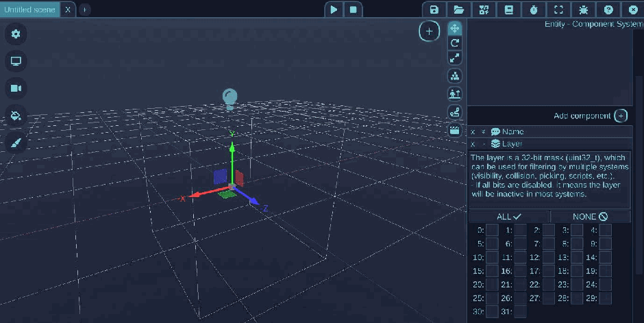

现在启用图层 0，它再次出现。这意味着如果没有图层处于活动状态，该实体将被禁用。当我将图层 0 设置为活动时，它再次激活：

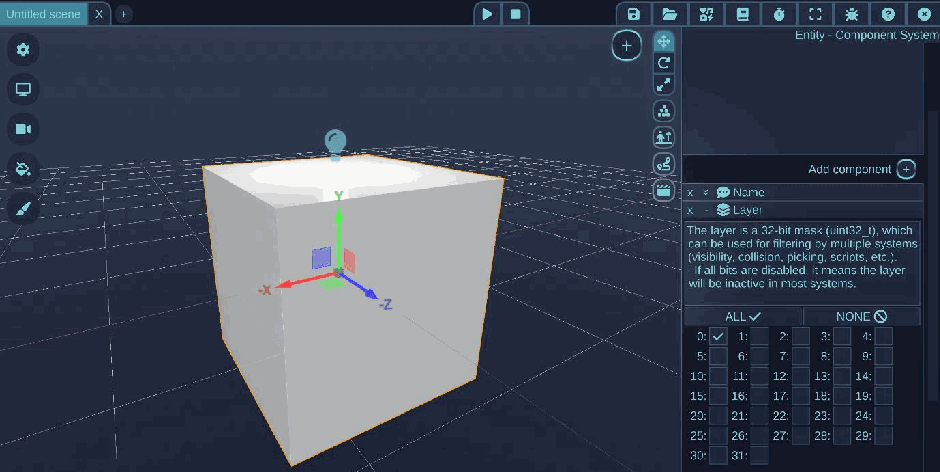

现在选择光源，禁用其所有图层（它消失），然后仅为光源激活图层 1：

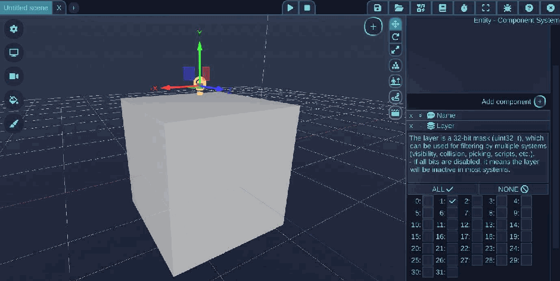

光源仍然没有出现，因为立方体的图层和光源的图层不包含彼此。现在添加一个球体对象并将其移离立方体，光源将影响球体但不影响立方体：

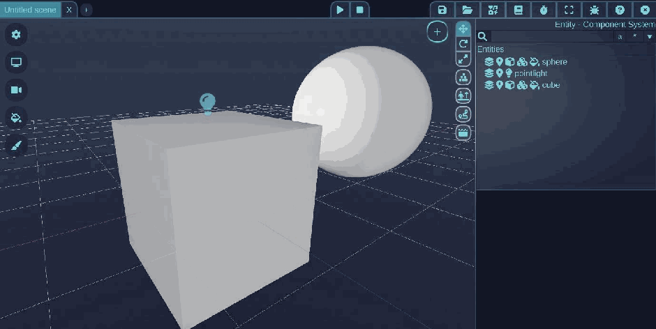

这是因为新对象默认启用所有图层。值得注意的是，如果立方体由材质在单独实体上的实体组成，对于光源过滤，需要修改材质的图层掩码。

贴花也可以实现类似效果，添加新贴花并将其放在立方体上，但让它也部分在球体上：


现在仅激活贴花的图层 1，因此与光源类似，它将只影响球体而不影响立方体：

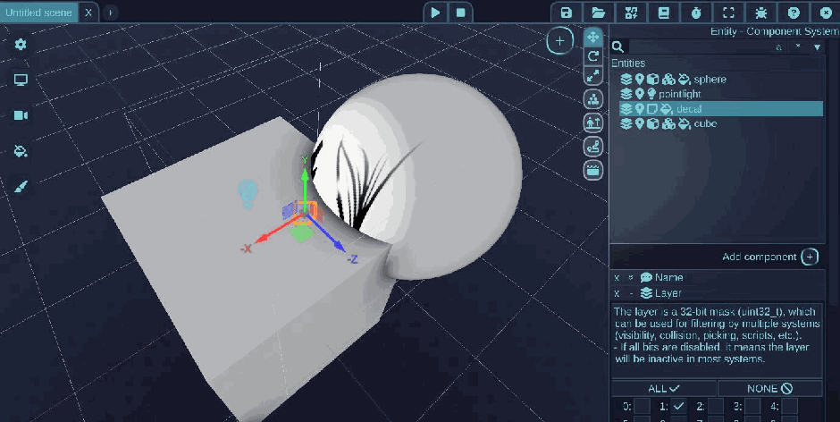

图层永远不会被引擎修改，它们完全由用户决定，且是可选的。如果实体没有图层组件，则假定它在所有图层中都活动。图层主要预期在游戏脚本代码中使用，例如用于过滤相交。一些引擎系统也会使用图层，但永远不会修改它们：
- 光源
- 贴花
- 环境探针捕获
- 一般可见性
- 光线追踪效果

图层通过实体层次结构继承，因此如果你为父级禁用一个图层，子级也将不会激活该图层，直到它们被附加。

## 反射探针

你可以通过放置环境探针为场景烘焙静态反射。这对于基于物理的渲染至关重要，其中金属和反射对象将失去自己的颜色以具有反射。如果没有反射，则将使用天空作为回退。你可以做的下一件事是使用反射探针，可能带有实时反射（屏幕空间或光线追踪）。创建默认地形，放置一个立方体，然后将立方体材质的反射率值设置为 1，你将得到一个不太好的结果：

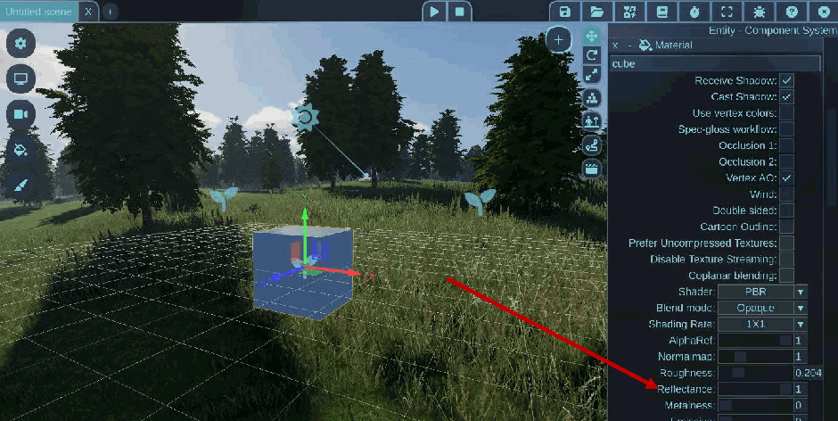

你可以从"+"按钮的下拉列表中放置环境探针。探针将放置在相机前方，场景将向所有方向捕获到立方体贴图纹理中。这将用作静态反射：

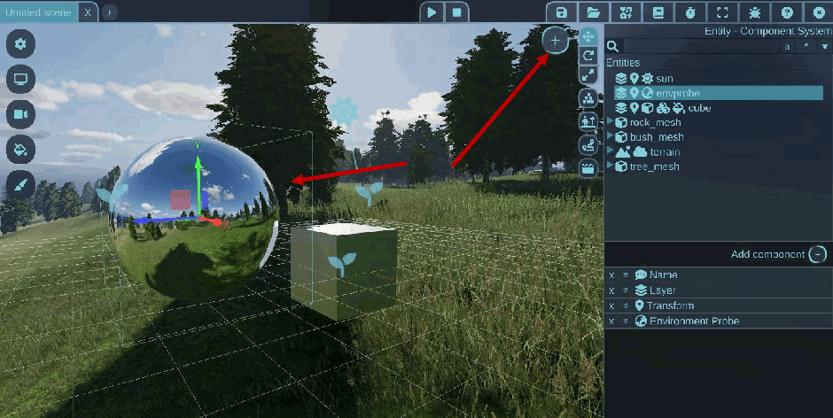

如果降低立方体材质的粗糙度，其上的反射将变得更清晰：

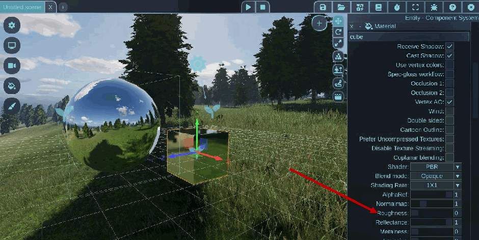

如果你选择探针球体（它不是真实对象，只是可视化器），可以检查探针设置，你还可以将其纹理保存到外部文件或加载立方体贴图到其中。你还可以重新渲染探针或将其设置为实时，它将每帧渲染。MSAA 选项将为探针使用多重采样渲染，可以提高其质量。你还可以为其设置分辨率，这会增加内存使用但会大幅提高质量。

你还可以使用图层根据探针和对象包含性来过滤哪些对象渲染到每个探针中。

放置在场景中的第一个反射探针将用作全局反射。你将放置的任何其他探针只在其边界（青色框）内起作用。你可以移动、缩放和旋转探针来设置影响区域。当探针边界更接近实际场景几何体时，反射也会显得更正确，因为将为它们进行视差校正，因此反射不会显得无限远。为了演示，水平缩放立方体并调整探针使其仅部分覆盖它：

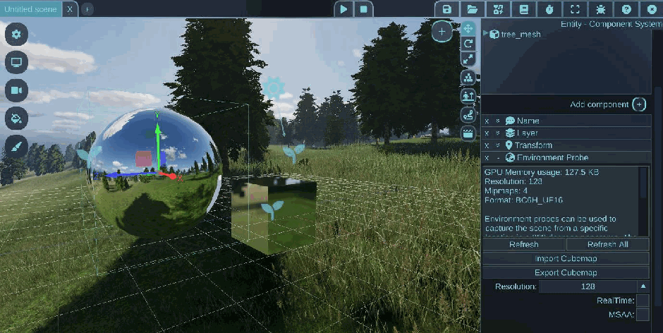

如你所见，在探针影响范围内，反射映射到立方体上，在其外部，全局反射可见为无限远。

如果你使用屏幕空间反射，环境贴图反射将在可能的地方被屏幕空间效果覆盖，因此它将显得更准确。但是，屏幕空间效果不会在屏幕的所有部分可见，在这些情况下它将回退到环境贴图。

在光线追踪反射的情况下，环境贴图将在反射中可见反射表面的地方使用，以避免计算递归反射，这将比已经昂贵的光线追踪反射在性能方面昂贵得多。

此外，当没有使用更准确的解决方案时，环境探针的平均颜色也将用于简单的漫反射颜色回退。

## 导航/寻路

你可以直接从编辑器内部创建导航结构。要能够使用导航，你必须创建体素网格并体素化场景。从 Content/models/sponza 文件夹打开 Sponza 模型。你也可以从内容浏览器中轻松选择它：

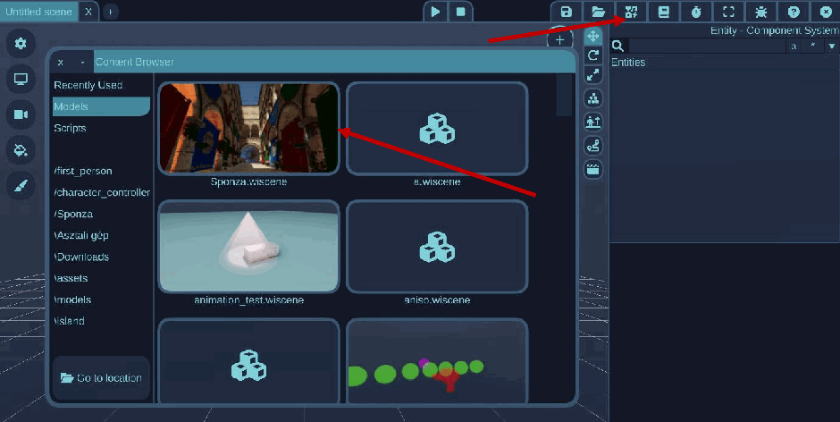

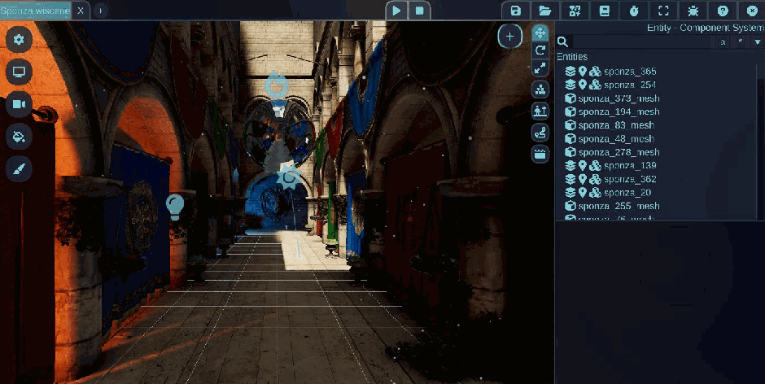

加载后，从"+"按钮的下拉菜单中添加体素网格。它立即被选中，所以打开体素网格设置：

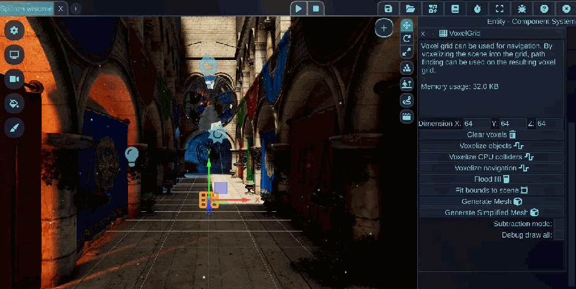

从这里，你可以按这些按钮：
- **"Fit bounds to scene"**，这将自动确定体素网格大小以包含场景中的所有内容。另一个选项是用手动方式通过变换工具的缩放模式缩放网格，在这种情况下就像缩放一个盒子。
- 之后，**"Voxelize objects"**将体素化每个对象并将其插入网格

现在，只要体素网格实体被选中，体素可视化器就会显示为绿色透明立方体：

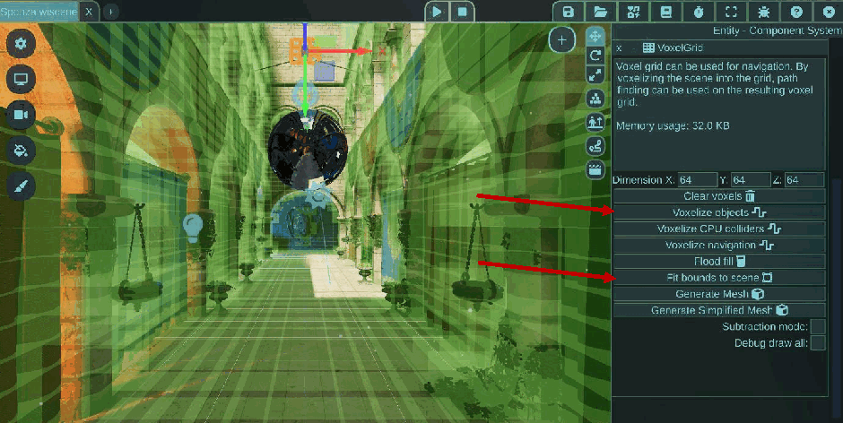

此体素网格可由游戏逻辑用于查询从一点到另一点的路径。你还可以通过激活 3D 工作区右侧工具栏上的导航测试按钮在编辑器中测试它。当它被激活时，地面上会出现两个路径点：

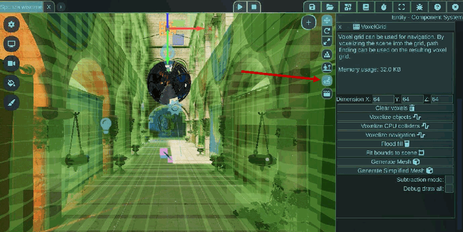

你可以按住 F5 和 F6 键并用中键点击某处来移动这些 START/GOAL 路径点。例如，当我将其中一个放在柱子和窗帘的另一侧时，你将看到路径立即被计算并绘制为曲线：

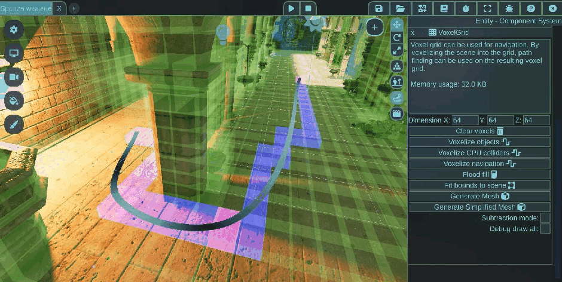

寻路有两种模式，上面显示的第一种是在地面或表面上的寻路。第二种是在空中的寻路。要在空中执行此操作，你可以使用 F7 和 F8 按钮以及中键将路径点放置在相机前方的空中：

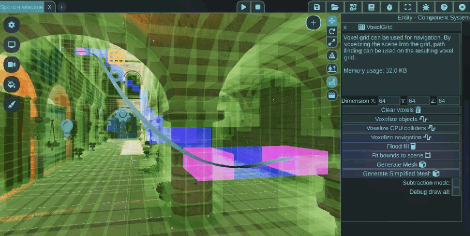

寻路可视化器有曲线、蓝色体素和粉色体素。曲线显示路径的推荐曲线，蓝色体素显示路径遍历的体素，粉色体素显示需要访问的主要体素路径点。游戏脚本可以非常容易地利用粉色体素位置来告诉非玩家角色在任何给定时间应该朝哪个方向前进。例如，查看 Content/scripts/character_controller 中的角色控制器脚本。

要进一步自定义体素网格，你还有一些更多选项，如设置分辨率、体素化碰撞器或体素化导航（仅体素化标记为"navigation mesh"的对象）。你还可以使用减法模式，因此体素化过程不会向网格添加体素而是移除它们。这背后的想法是你可以用形状在体素化中切割孔洞，例如用减法模式将碰撞器体素化到填充的体素网格中。

## 物理

为了理解如何设置物理，让我们通过一个简单示例。创建一个平面和一个立方体对象，并将它们设置为平面是地板、立方体坐在其上面的样子：

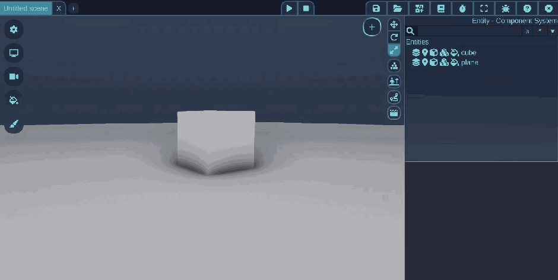

现在为两者添加刚体物理组件。你可以同时选择两者并添加组件：

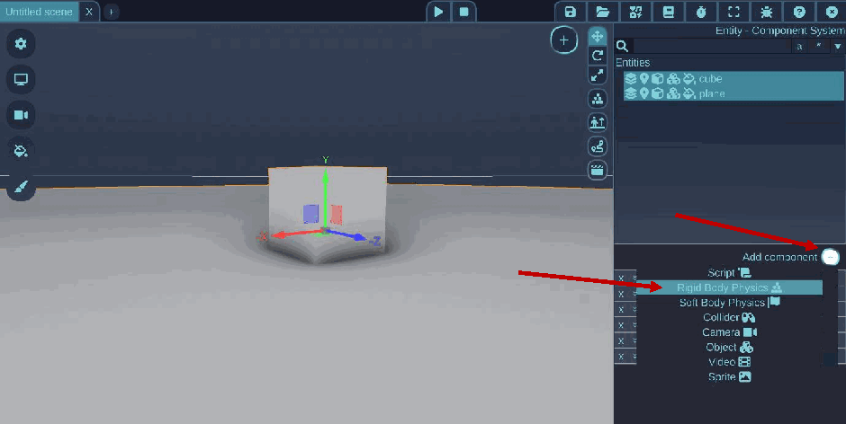

从常规选项中打开物理可视化器：

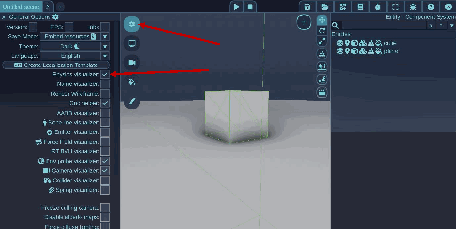

由于两者都使用"Cube"物理形状，立方体很好，因为碰撞形状（绿色线框）紧密匹配图形网格。选择平面并将其物理形状设置为"Triangle mesh"，这对于静态物理对象通常是不错的选择，地板将是。现在碰撞形状匹配两个对象：

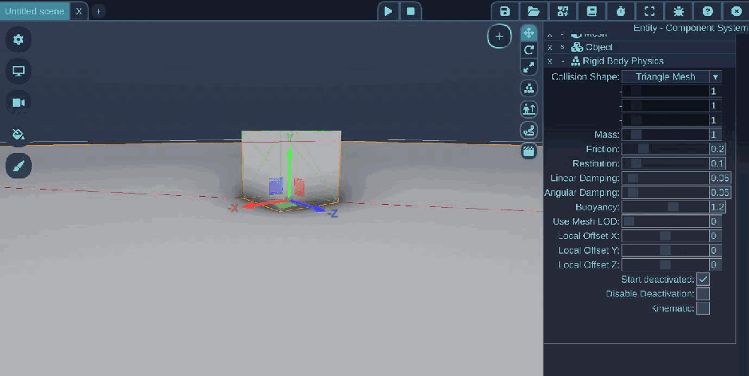

现在两个对象都是动态的（但已停用），但我们希望地板是静态的，所以将其质量设置为 0。如果尚未启用，用 3D 工作区右侧的按钮启用物理模拟。现在你可以用中键抓住立方体并用物理拖动它/放下它。它不需要被选中即可进行物理拖动。

现在从 Content/models 添加 bunny.obj 网格，将其放在地板顶部并添加软体组件。这可能需要一些时间，由于这是相当高多边形的网格，软体物理会很慢，兔子会塌陷：

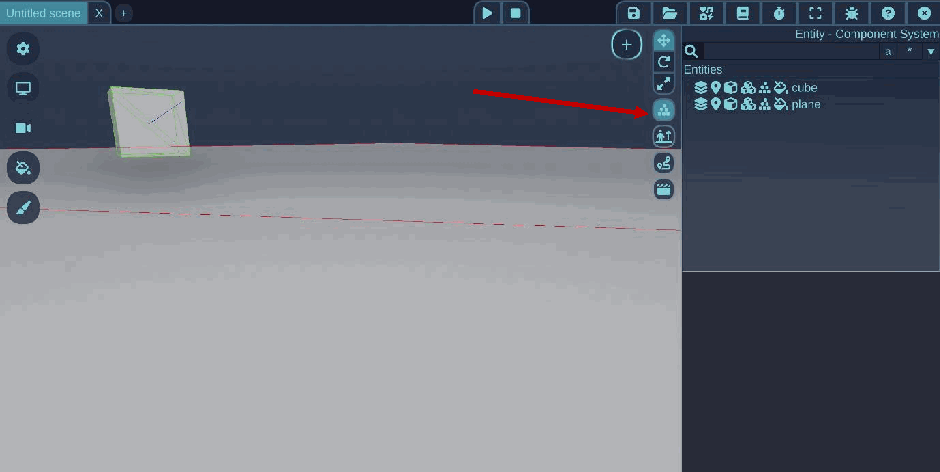

如果降低 LOD Detail 滑块，可以使它更稳定，我现在也禁用了物理可视化器：

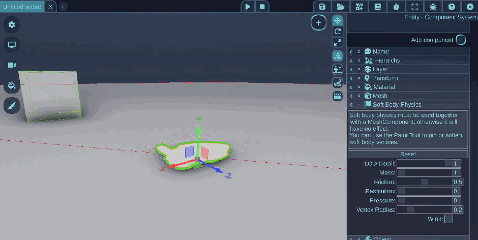

你也可以用中键拖动软体，它们不需要被选中：

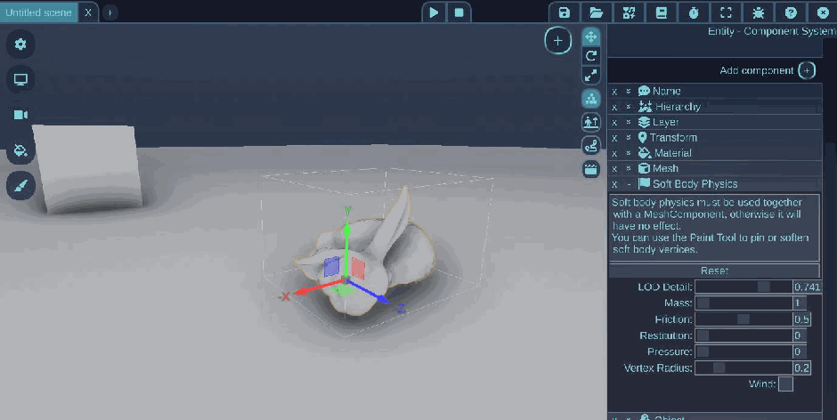

有关更好的示例，请查看 Content/models 文件夹中的 physics_test.wiscene 和 cloth_test.wiscene 模型。physics_test 显示了一堆掉落的刚体和一个软体：

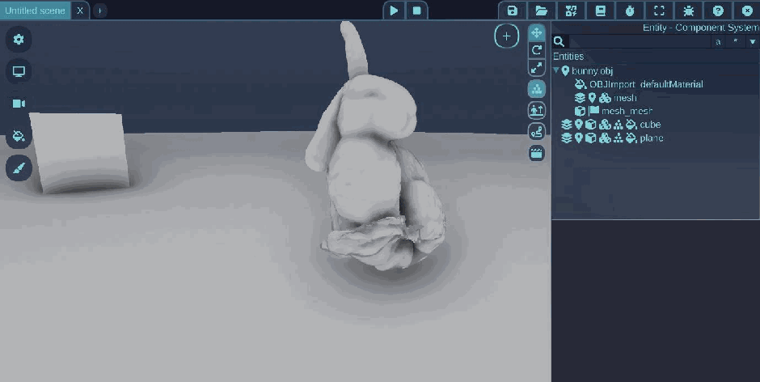

cloth_test 显示了一个用作旗帜的简单细分四边形形状：

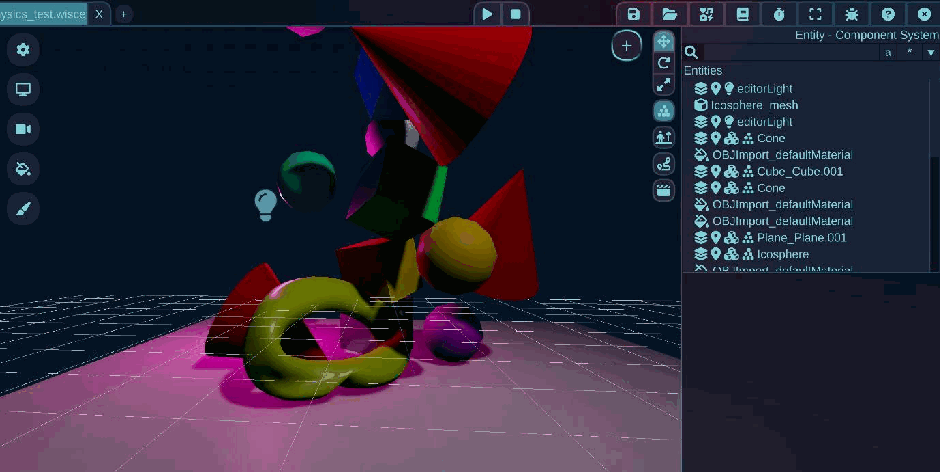

这面旗帜还展示了其他内容；软体被固定在原位，因此整个东西不会掉落，但它的一些顶点被模拟。进入绘制工具的软体固定模式，将这些固定顶点绘制到软体网格上：

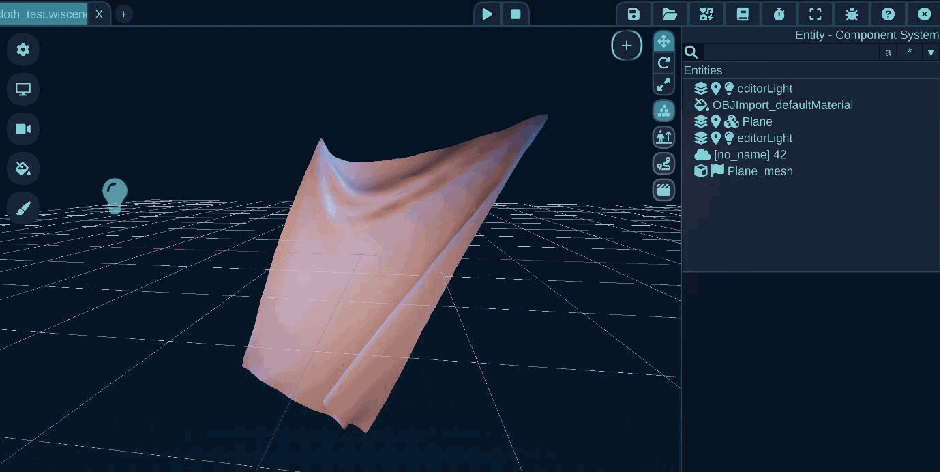

反向操作也可以用绘制工具的 Softbody – Physics 模式完成，通过绘制移除固定顶点。请注意，在高多边形网格上绘制此固定可能很慢，因此对于软体，最好使用尽可能低多边形数量的网格。

## 毛发粒子系统/草地

毛发粒子系统可用于程序化生成附着到网格表面的粒子。要从头创建一块草地，可以先创建一个生长粒子的网格。添加新平面对象，稍微放大，然后用 3D 工作区右上角的"+"按钮添加毛发粒子系统实体：

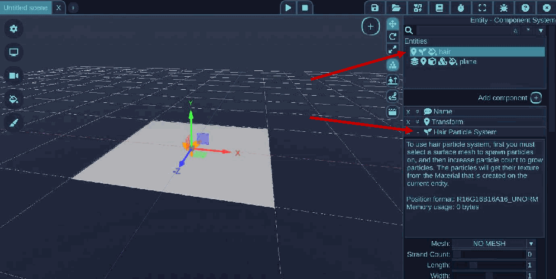

然后从毛发粒子设置中选择平面网格，并增加发丝数量：

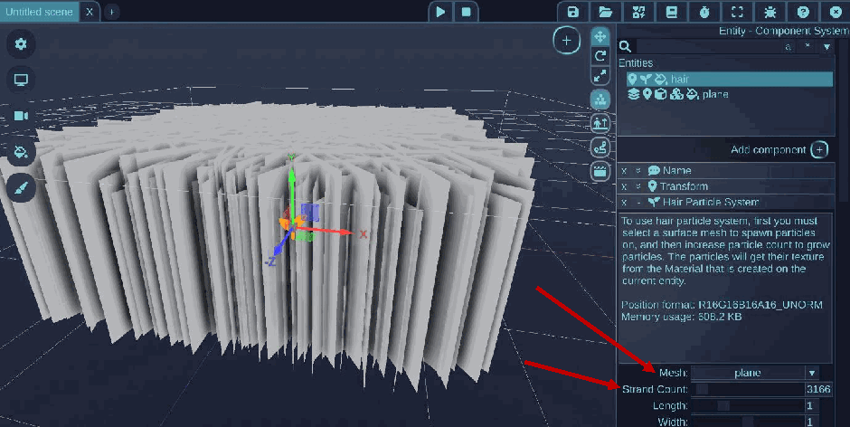

现在你看到粒子已添加，但它们太大了，你可以调整它们的长度，或放大它们。要将它们与平面对象一起放大，选择对象和毛发并缩放它们。如果你放大它们，它们的长度将保持不变，但表面积更大，因此它们将分布在更大的区域：

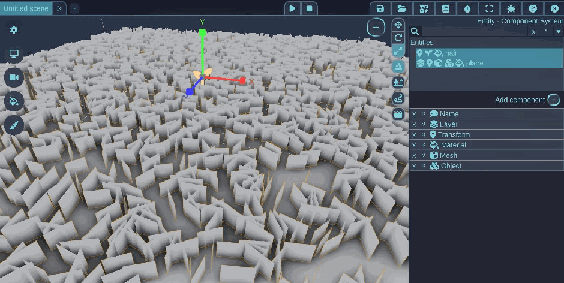

粒子有点无聊，因为它们都只是白色四边形。要创建类似草地的东西，你可以转到毛发实体的材质并设置其纹理。最简单的方法是将其设置为包含透明背景上单个草块的纹理，类似这样（你可以在 Content/models/grassbb.png 中找到此纹理）：

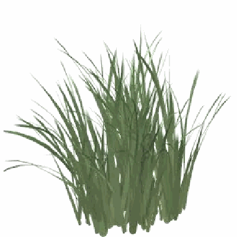

所以你打开毛发实体的材质并为此"BaseColor map"槽设置此纹理：

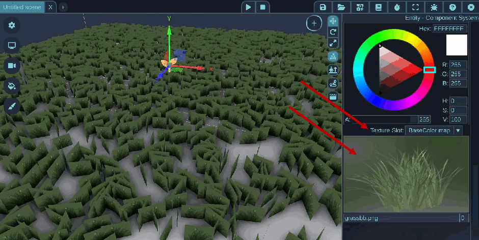

要剪掉草地纹理的透明度，将材质的 AlphaRef 降低到 1 以下：

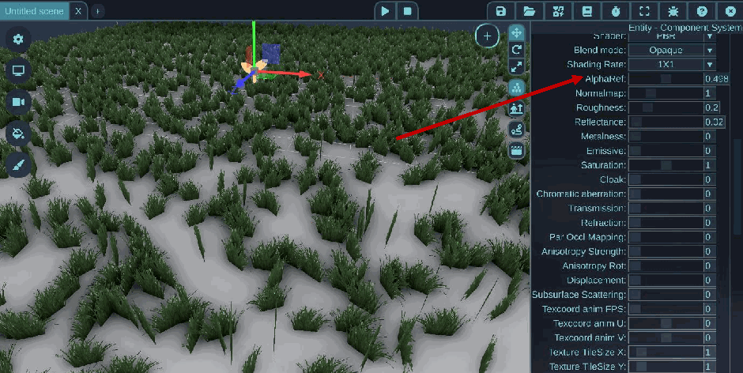

毛发粒子系统还允许你使用纹理图集而不是单个草地精灵来获得更多变化。例如，我可以通过将 Content/models/grassbb.png 和 billboardedflowers.png 组合成单个纹理来创建图集：

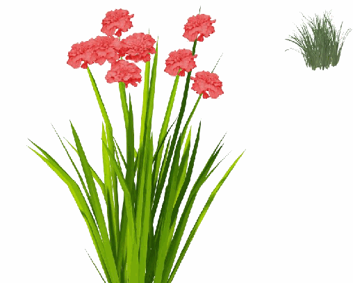

此图集在单个纹理中包含两种不同大小的草地类型。如果将此纹理设置为毛发材质，你将得到：

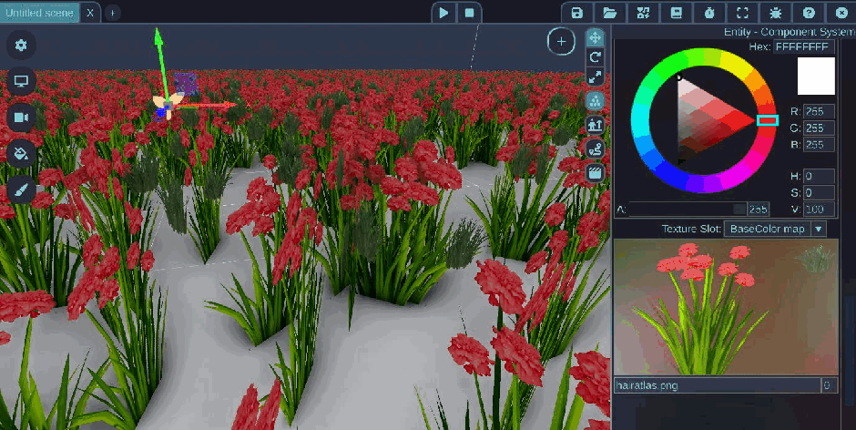

这还不够好，因为每个粒子只显示整个图集。要添加要使用的纹理较小部分，转到毛发粒子系统设置，并使用"Select sprite rect"按钮，这将打开矩形编辑器：

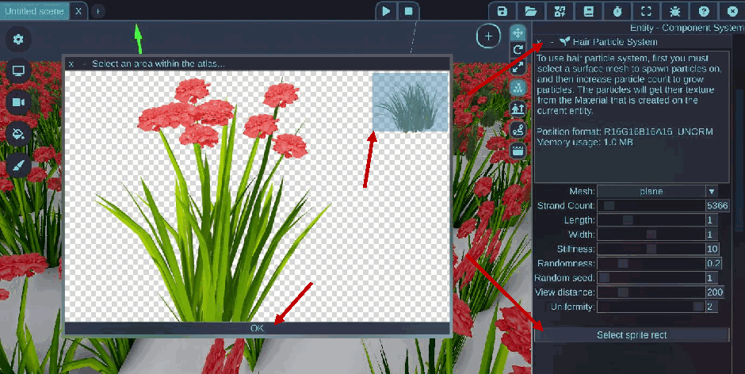

选择草地部分并点击 OK 后，粒子将更改为仅包含该纹理部分：

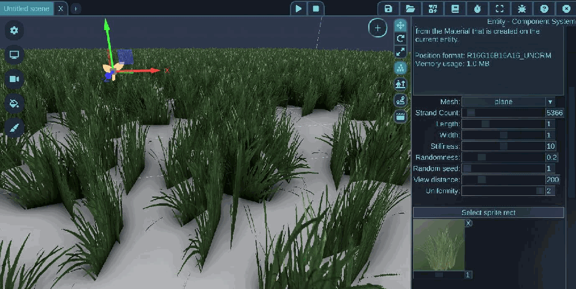

你可以再重复此过程以添加花朵纹理。对于每个矩形，你可以返回调整它，并用其下方的小滑块设置其长度（相对于整体粒子系统长度）。你还可以调整 Uniformity 滑块来控制草地类型的随机分布：

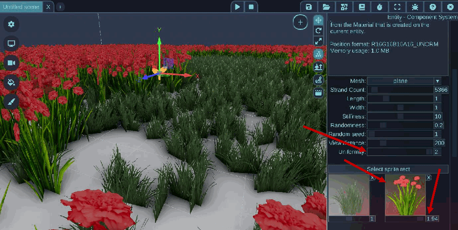

草地将自动对力和 GPU 碰撞器做出反应。例如，你可以添加碰撞器实体，调整其形状并将其设置为 GPU。它们将推开毛发粒子：

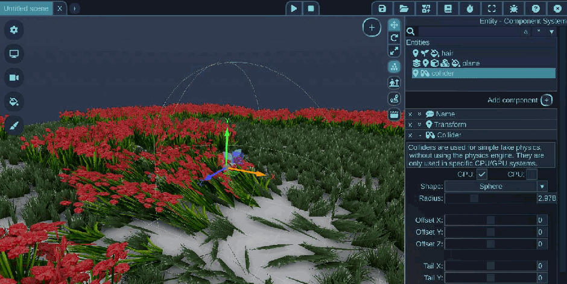

此技术也用于 Content/scripts/character_controller 示例脚本，让角色在穿过草地时推开它。在这种情况下，碰撞器只是简单地附加到角色。

绘制工具也可用于修改草地，例如你可以查看本文档中的地形章节，其中显示了地形草地的示例。

## 发射器

发射粒子系统可用于创建漂浮粒子。要创建一个，只需从"+"按钮添加发射器。你将得到一个即用型简单发射器，它发射无纹理的面向相机的四边形：

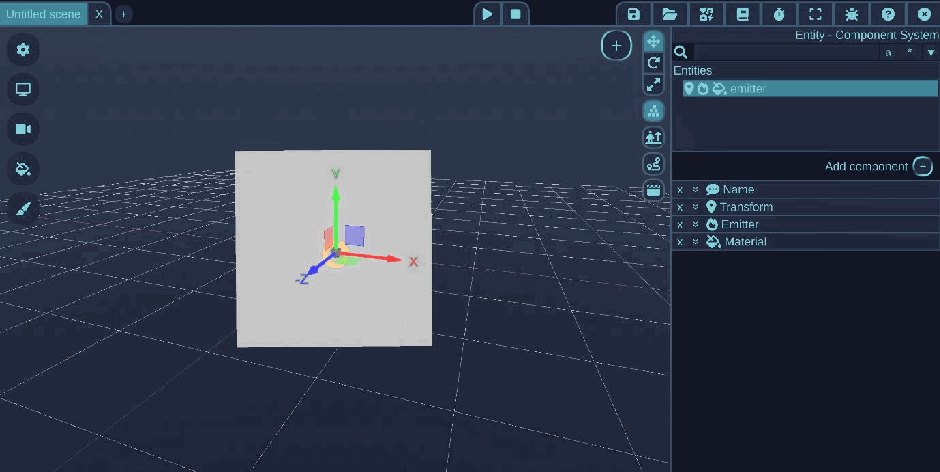

要设置它们的纹理，转到实体的材质设置并将纹理添加到"BaseColor map"槽：

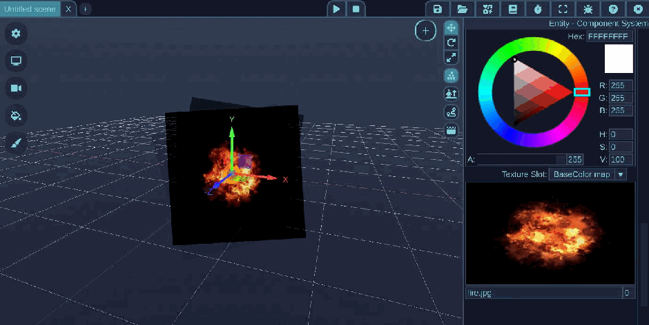

此火焰纹理使用加法混合会更好看，可以移除黑色背景，如果多个火焰粒子重叠，它也会变得更亮。你可以在材质的 Blend Mode 设置中设置此选项，选择"Additive"：

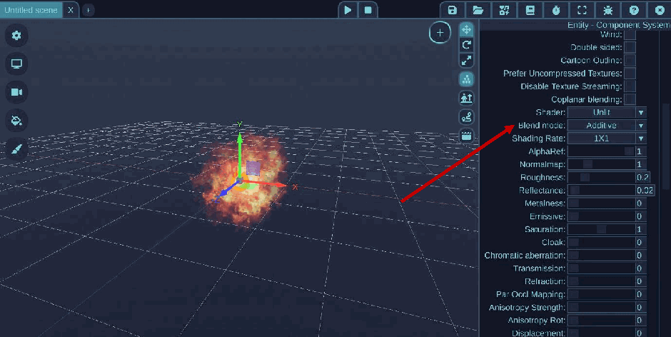

加法混合的优点还在于此混合模式是顺序无关的，意味着粒子的顺序对渲染结果不重要。使用非加法混合模式时，你可能会遇到粒子闪烁，因为 GPU 可以以非确定性顺序模拟它们。要修复它，你可以简单地在发射器设置中启用排序。排序会导致额外的性能损失。使用加法混合时，通过使用 Emissive 属性也可以轻松使火焰粒子更亮：

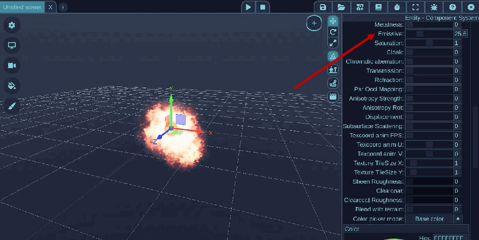

现在让我们回到发射器设置并增加发射计数和法线因子，让它们从中心飞出：

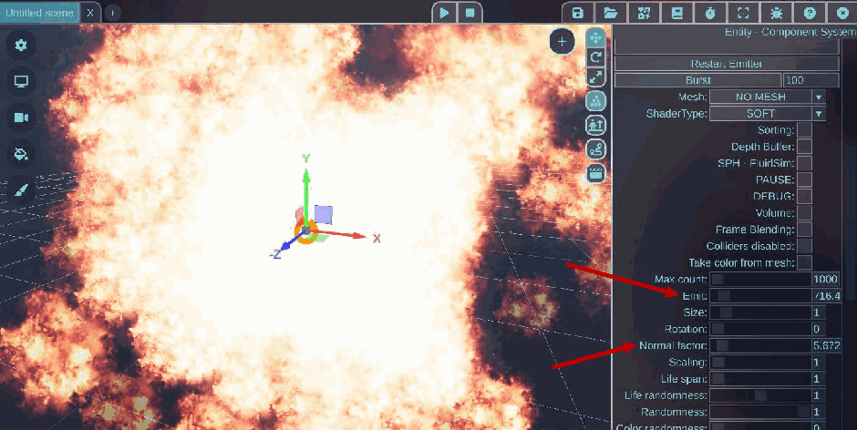

力和 GPU 碰撞器也会影响发射粒子的运动。你看到了在毛发粒子系统中使用 GPU 碰撞器的示例，现在让我们看一个使用力的示例。从"+"按钮添加力并将其从发射器移开一点。增加其范围并为其设置正重力和一些范围以吸引粒子：

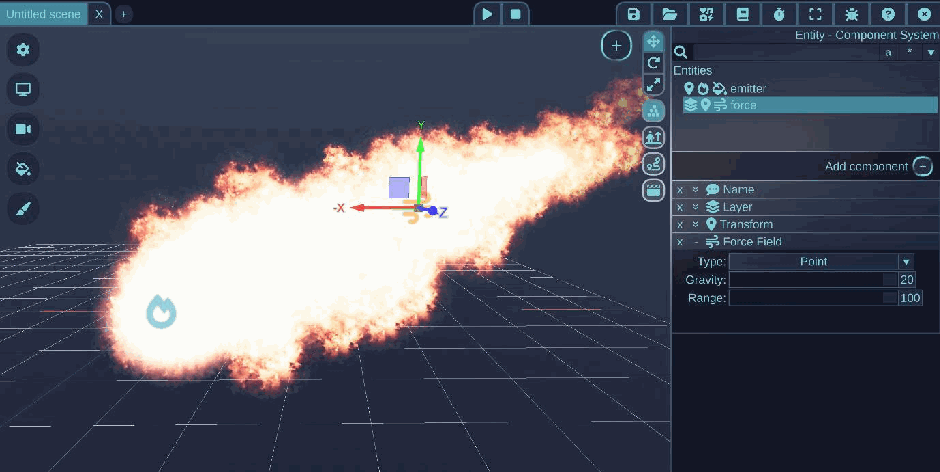

负重力将偏转粒子：

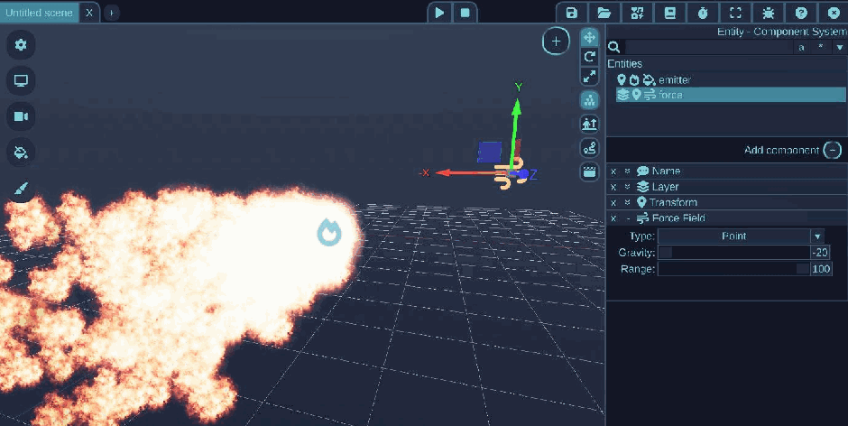

如果从常规选项中打开"Force field visualizer"，可以可视化力场范围：

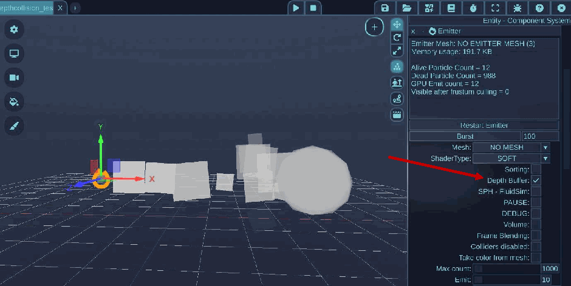

还有更多粒子示例模型可供查看。
1. 深度碰撞可用于粒子与深度缓冲区碰撞，因此屏幕上的不透明对象（emitter_depthcollision_test.wiscene）：

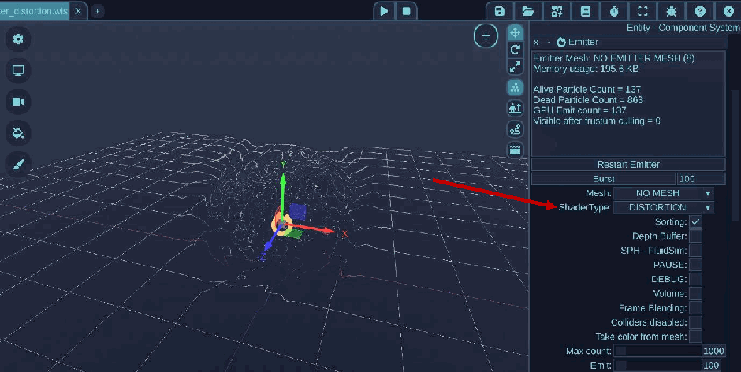

2. 扭曲着色器可用于在发射器材质中使用法线贴图来扭曲渲染（emitter_distortion.wiscene）：

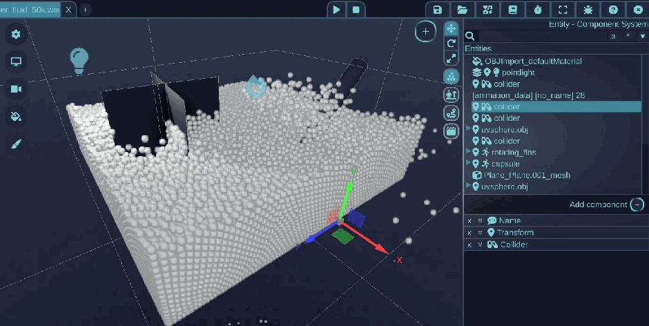

3. 流体模拟，展示基于 GPU 的流体粒子物理与碰撞器（emitter_fluid_50k.wiscene）：

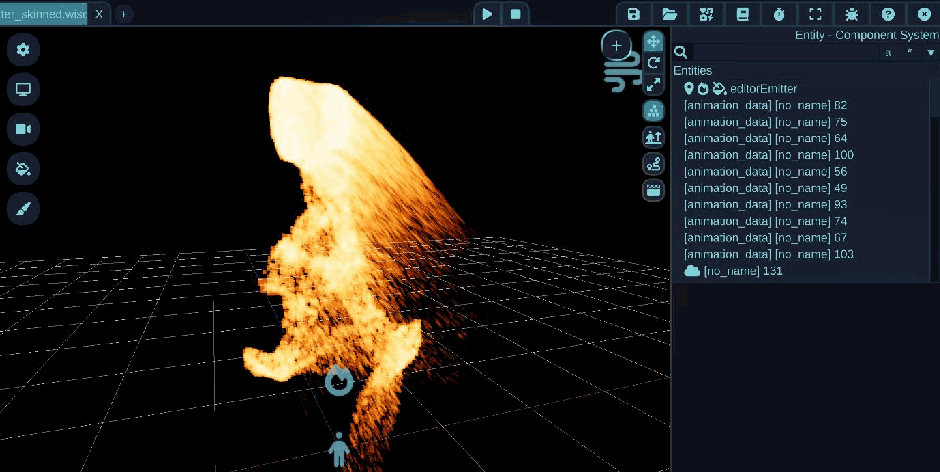

4. 从蒙皮和动画网格表面发射粒子（emitter_skinned.wiscene）：

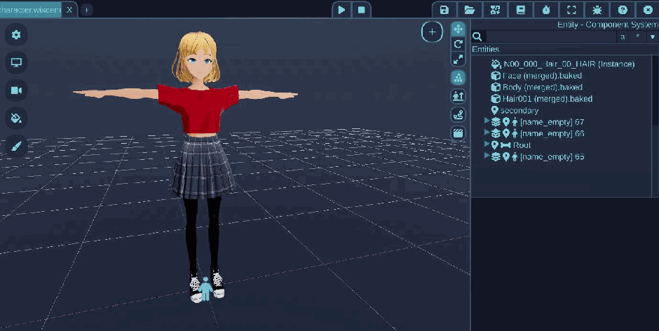

发射器有很多功能，其中大部分尚未在本文档中详细描述。

## 弹簧/摇晃骨骼

导入 VRM 角色（可在 Vroid Studio 中创建）时，角色将自动在其骨架中接收具有弹簧组件的特殊关节。这样的示例角色可以在 Content/scripts/character_controller/assets/character.wiscene 中找到。或者你也可以打开你创建的 VRM 模型：

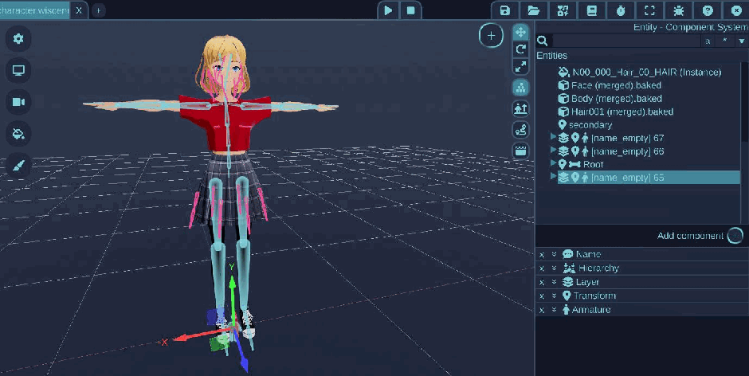

选择骨架（角色下方的小人图标）以查看骨骼：

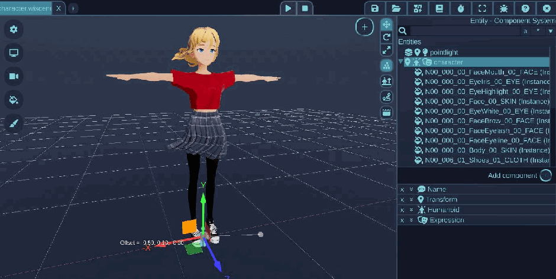

蓝色骨骼是常规骨骼，粉色骨骼是具有弹簧组件的骨骼。这些用于摇晃物理，通常为头发和衣服制作动画。这些骨骼通常没有关键帧动画，但它们将在创作的动画之上添加额外的程序动画。要简单地查看效果，抓住整个角色模型的根实体并用变换工具移动它。

你会注意到角色的裙子和头发将以简化的物理效果摇晃：

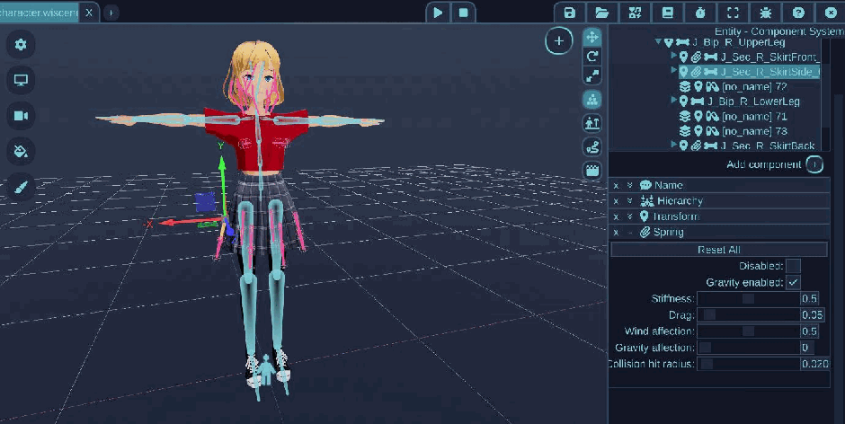

这不是真正的物理，因为即使禁用物理模拟它也能工作，而是简单的程序动画。这也使它们快得多，如果你不需要像布料物理那样精确的物理模拟，则推荐使用。与物理模拟相比，它们也不能拉伸且更稳定。如果你选择一个弹簧骨骼，你将看到弹簧设置和大多数弹簧尖端的附加调试球体：

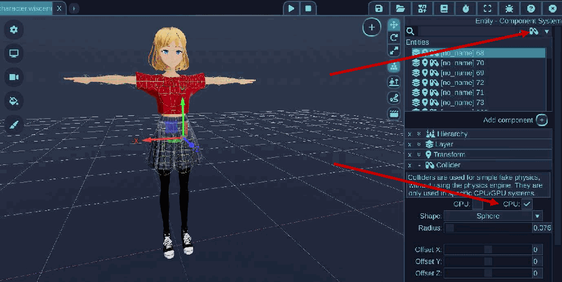

小球体对应于它们的碰撞命中半径。这在与 CPU 碰撞器碰撞时使用。角色本身也将配备一些 CPU 碰撞器，帮助头发不进入头部，裙子不进入大腿：

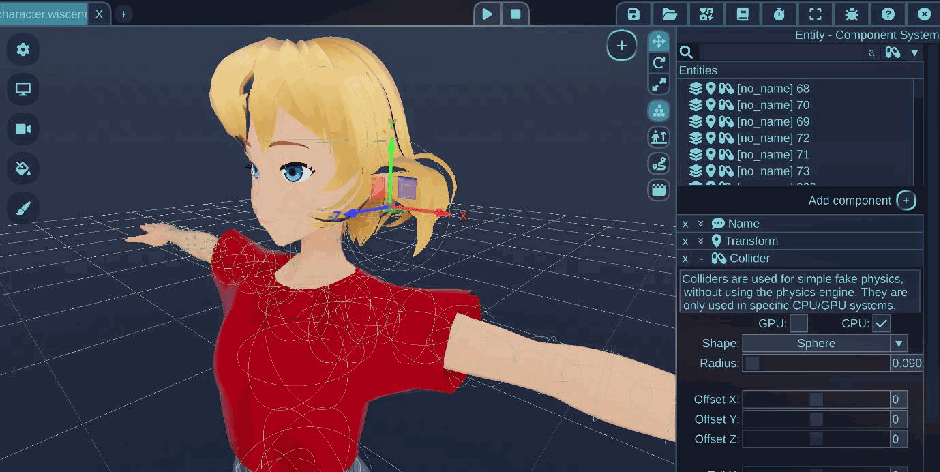

如果你还在实体面板中过滤以仅查看碰撞器：

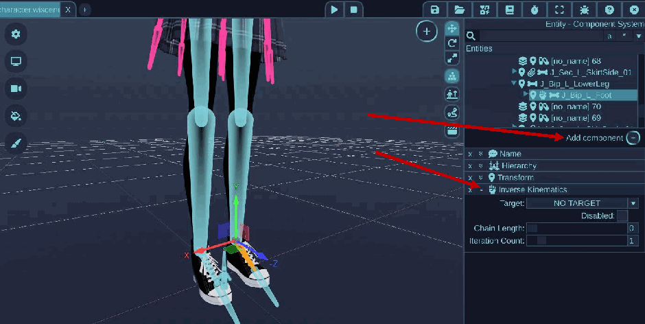

如果你还选择其中一个碰撞器，它们都将用调试球体可视化。如你所见，角色由几个球形碰撞器组成，标记为"CPU"。你还可以创建 CPU 碰撞器并自己测试弹簧碰撞。添加新碰撞器并将其设置为 CPU，然后将其移动到例如她的头发附近以与之碰撞：

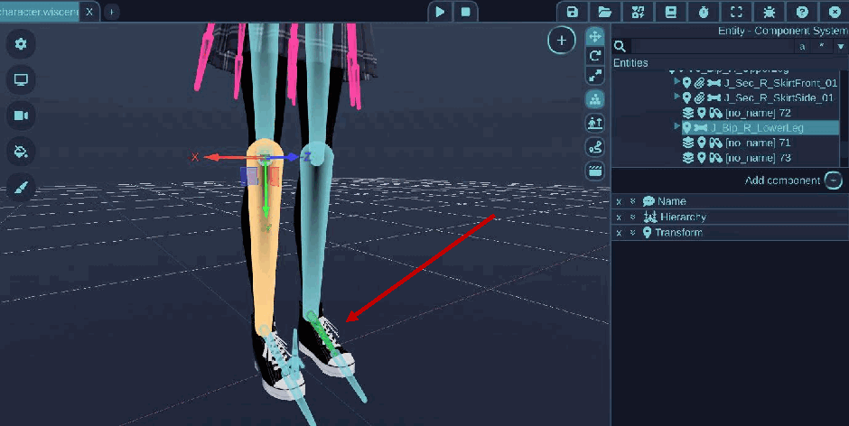

再次注意，碰撞器组件不是物理对象，它只作用于这些特定系统：
- 发射器
- 毛发粒子
- 弹簧
- 用户脚本

## 反向运动学

你可以从编辑器内部创建反向运动学。这通常用于骨架，虽然不限于它们。通常用于角色的手臂和腿部。在 Wicked Engine 中，如果你为人形骨架的手臂或腿部骨骼执行此操作，它们还可以有额外的自动约束行为。使用之前的角色，选择她的一只脚并向其添加反向运动学组件：

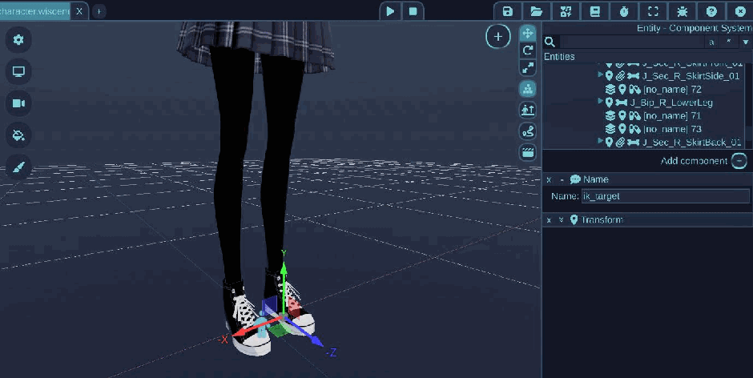

如果你现在取消选择不同的骨骼，你会看到具有反向运动学的骨骼有特殊的绿色颜色以便于区分：

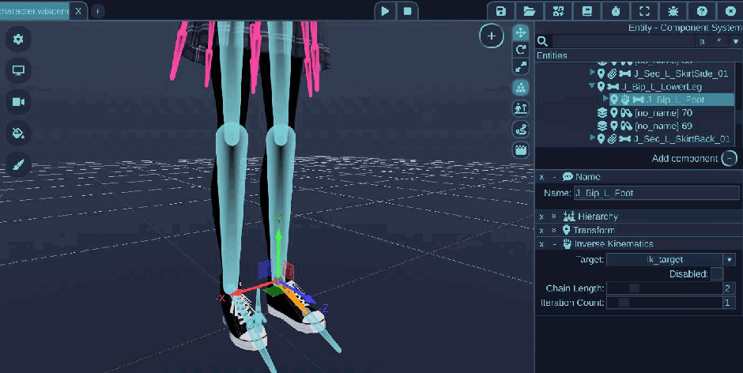

对于反向运动学，我们需要一些目标，所以创建一个空变换并将其移动到那只脚附近。我还将其命名为 ik_target：

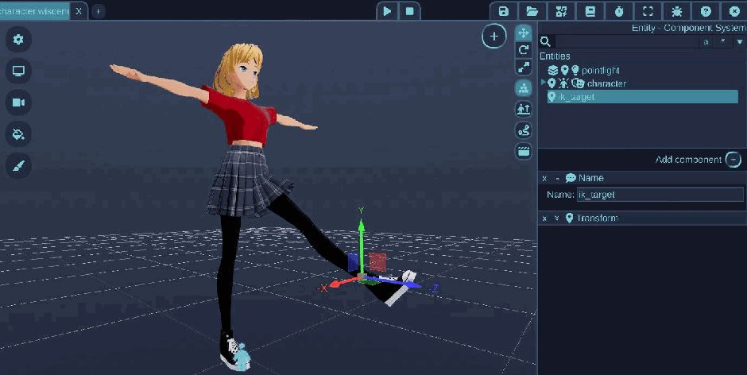

现在选择带 IK 的脚部骨骼并选择 ik_target 作为目标（将在列表底部），然后将链长度增加到 2（使其包括小腿和大腿骨骼）：

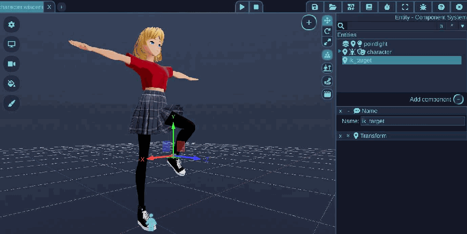

现在如果你抓住 ik_target 变换（在实体列表面板中选择它）并移动它，整条腿将跟随：

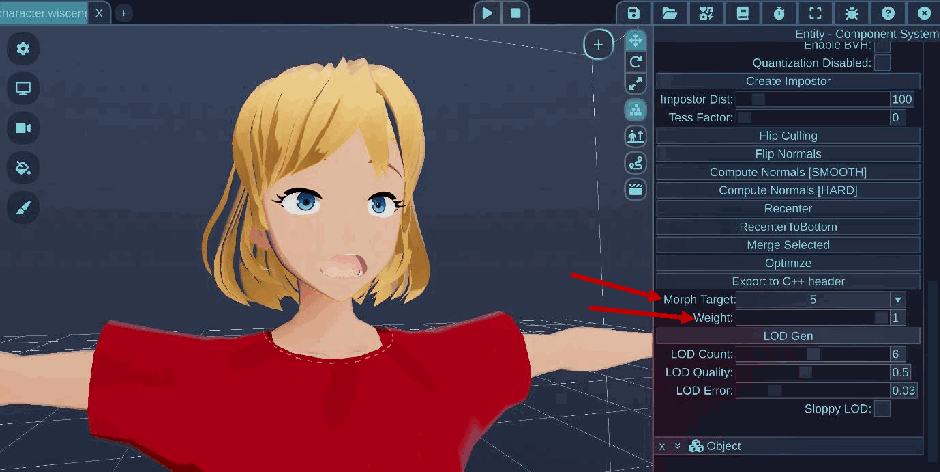

现在不太准确，因为它使用低迭代计数。回到脚部 IK 并将迭代计数增加到 10。腿将更准确地跟随 ik_target，膝盖也更容易弯曲：

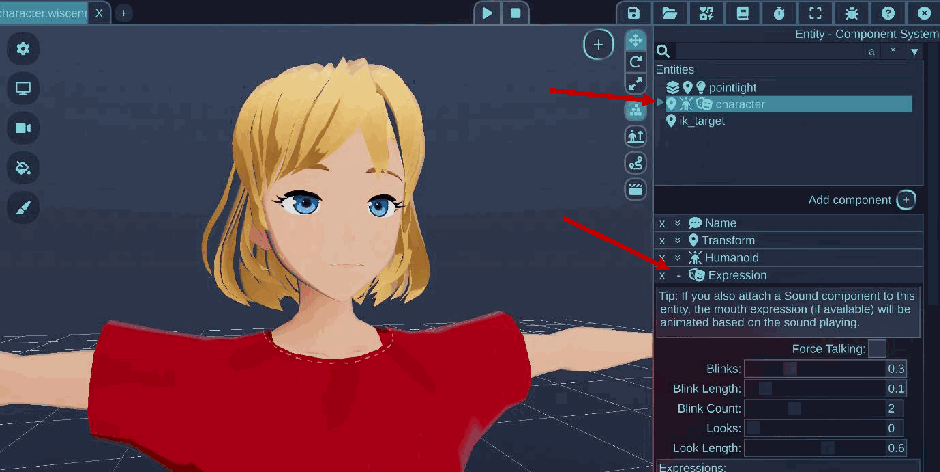

因为此模型的骨架是人形组件的一部分（VRM 和 Mixamo 模型会有此组件），引擎还确保膝盖或肘部不会向后弯曲。

## 表情、变形目标

让我们继续使用此角色模型，因为它还有可以在此展示的表情和变形目标。变形目标是一种没有骨骼的网格变形方式，使用顶点变形姿态，可以从网格控制。表情是由单个值操作的变形目标集合，它们可以由表情组件控制。首先让我们看变形目标。通过点击选择角色的脸部，然后找到变形目标并选择 [5]，然后将其权重增加到 1：


你看到效果，脸部网格变形为惊讶姿态。现在重置变形目标并找到角色基础实体上的表情组件：

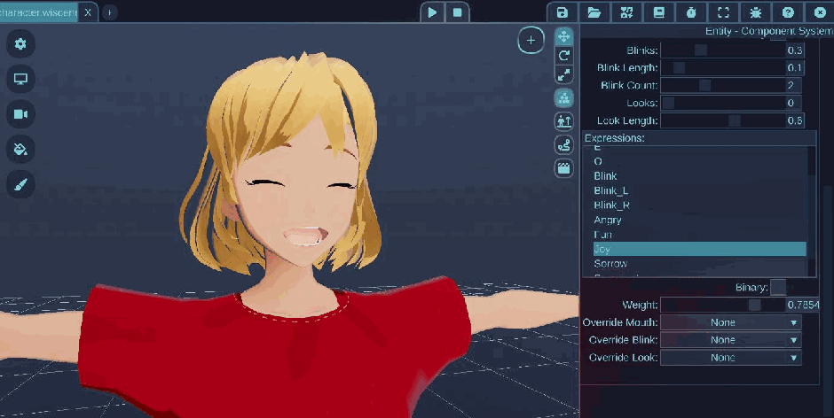

表情是控制具有预定义功能的变形目标集合的更好方式。这里你可以指定预构建行为，如眨眼和说话。尝试启用强制说话，角色将开始随机发音：

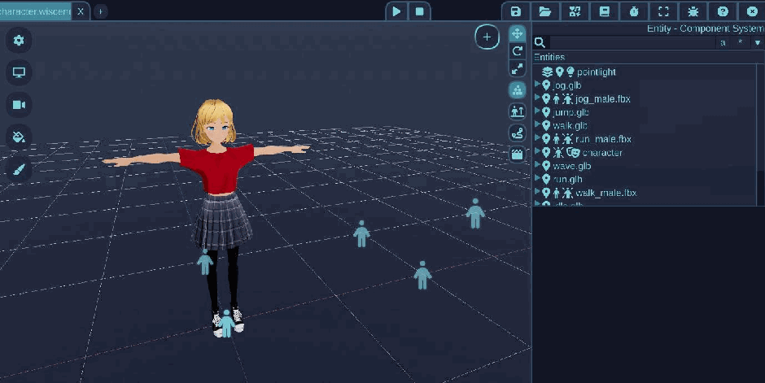

关闭它，并检查其中一个预设表情，如 fun 并增加其权重：

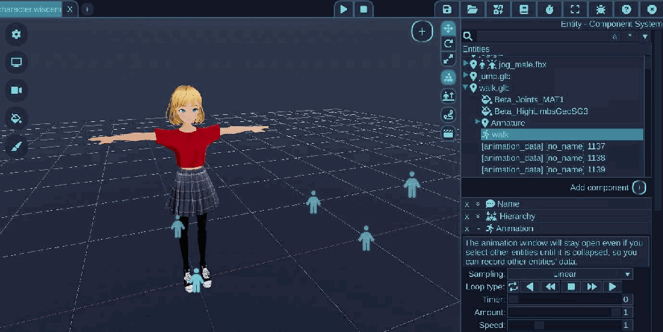

此表情将控制多个变形目标以创建欢乐表情，如你所见脸部和嘴巴都受到影响。在此特定表情中，覆盖自动眨眼也很有用，因为当眼睛已经闭上时眨眼很奇怪。为此，你可以将"Override blink"设置为"Block"。

在 Vroid Studio 中创建的 VRM 模型将始终具有你可以控制的这些内置表情。有关如何从脚本控制它们的示例，请查看 Content/assets/character_controller 脚本。

## 动画重定向

要将动画应用于角色，动画和角色都必须作用于人形骨架。人形动画可以从 Mixamo.com 作为 FBX 模型轻松下载。人形角色可以从 Mixamo.com 作为 FBX 模型下载，或在 Vroid Studio 中创建为 VRM 模型。让我们找到两个示例模型并在编辑器中都打开它们：
- Content/scripts/character_controller/assets/animations.wiscene
- Content/scripts/character_controller/assets/character.wiscene

角色模型和几个动画现在在场景中。你也可以为此打开骨骼可视化，或就这样留着。角色没有自己的任何动画。选择 walk.glb/walk 动画：

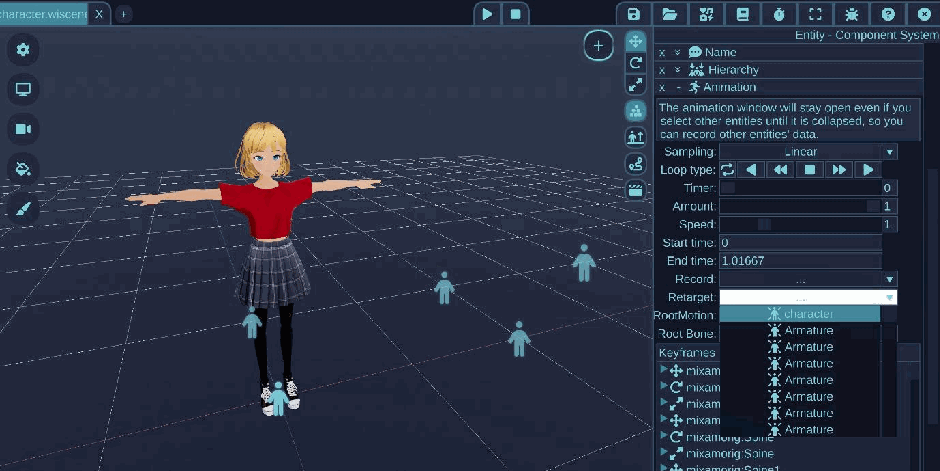

向下滚动到动画设置内的 Retarget 选项，并选择"character"：

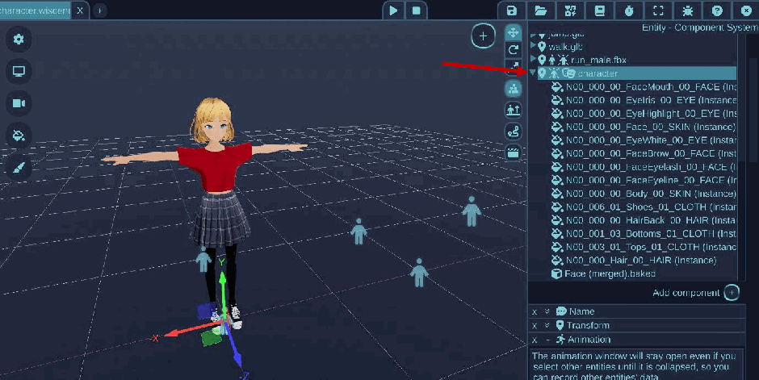

点击时似乎什么也没发生，但现在你可以转到角色实体并打开它以在其中找到 walk 动画：

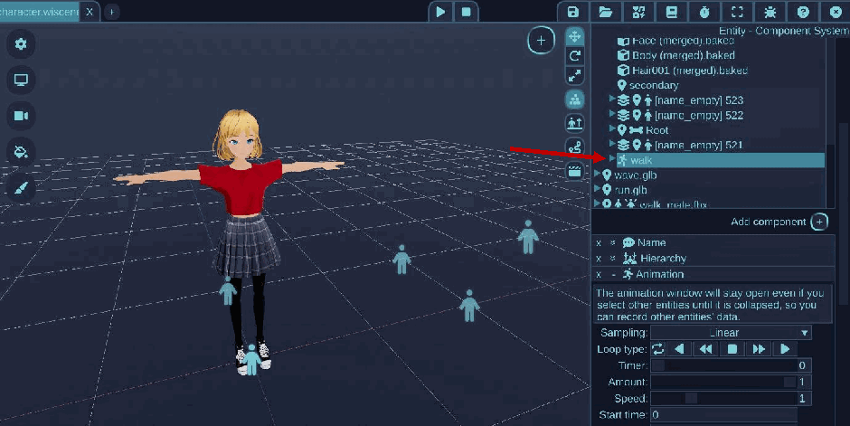

你可以启动动画以检查它是否正常工作：

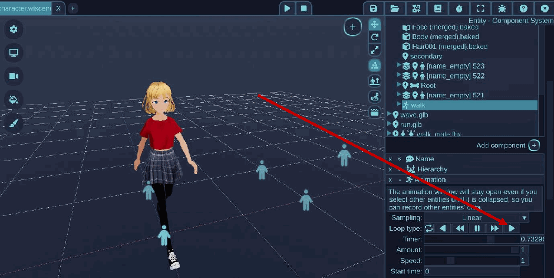

这是在编辑器内部检查动画重定向如何在角色上工作的好方法。但此类重定向会创建存储在角色内部的额外动画数据，可能占用额外内存。在游戏脚本中，你还可以指定重定向进行"运行时"重定向，它不制作动画数据的副本，但角色可以改为从单独场景重用动画。因此，使用运行时重定向不需要将动画放入我们的主场景，而是以不多的额外内存使用为多个角色重用动画。但是，如果你想保存嵌入了动画的角色，此方法将不起作用，这就是编辑器选择此方法的原因。

有关运行时重定向，请查看 Content/scripts/character_controller 脚本。

## 元数据

可以创建和放置元数据组件到场景中，以帮助直观地识别实体，并附加可从游戏代码轻松检索的自定义值。你可以从"+"菜单简单添加一个：

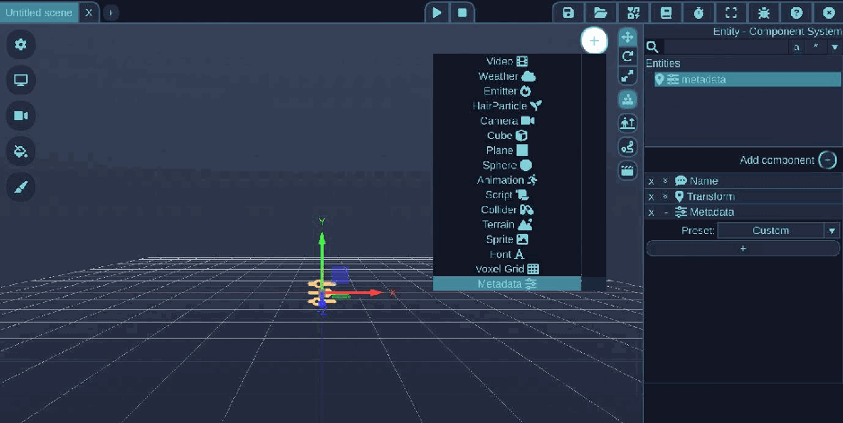

开始时里面什么都没有，但你可以用不同类型向其添加自定义属性，目前可以是：
- Bool
- Int
- Float
- String

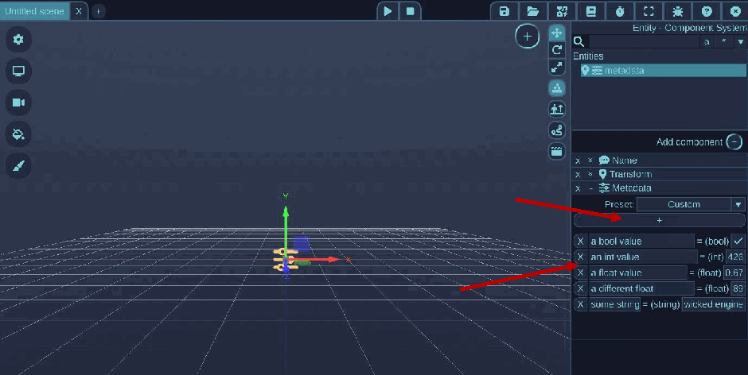

引擎不会对这些做任何事情，完全取决于你想用它们做什么。例如，角色控制器示例使用自定义属性定义角色名称，这将确定要加载的角色模型。

还可以为此设置预设，这仅是游戏代码的枚举，但编辑器有特定的可视化器帮助你将它们放置到场景中：
- Waypoint（路径点）
- Player（玩家）
- Enemy（敌人）
- NPC
- Pickup（拾取物）
- 未来可能更多...

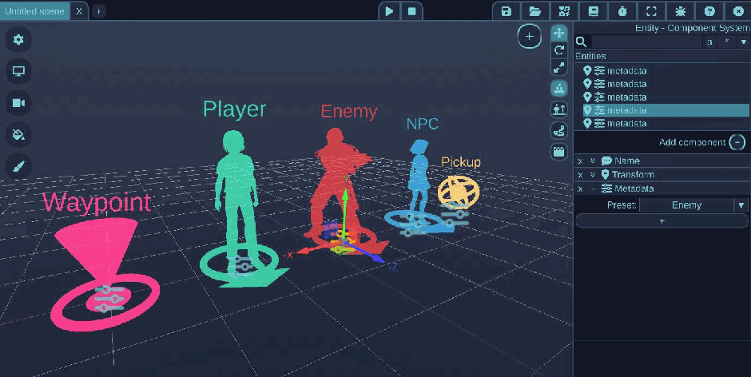

角色控制器示例根据放置在关卡各处的元数据组件的预设值确定要放置什么类型的游戏对象。如果没有你想要的预设值，始终可以使用自定义属性代替。

## 高斯泼溅

可以通过简单拖放将高斯泼溅模型从 .PLY 文件导入编辑器窗口，或使用"打开"文件浏览器作为常规模型。高斯泼溅模型可能看起来像这样：

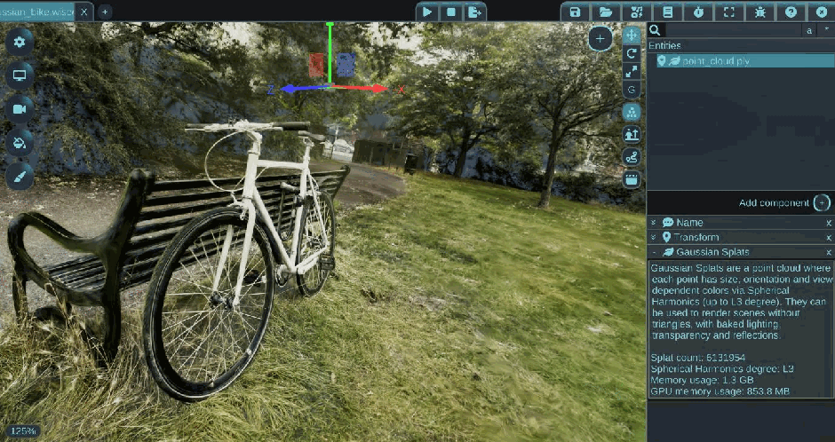

此模型是高斯泼溅参考实现的一部分。[下载示例模型]

高斯泼溅模型可以是一个巨大的点云数据，每个点具有大小、方向和视角相关颜色，并包含多个对象。它与常规三角形网格的渲染方式不同，它们支持透明度、反射和真实静态光照等效果。

## 结语

感谢你阅读 Wicked Engine 编辑器的文档。目前，它旨在展示一些常用和有疑问的功能，但不是所有编辑器功能的完整说明。文档将继续更新。

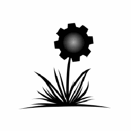
